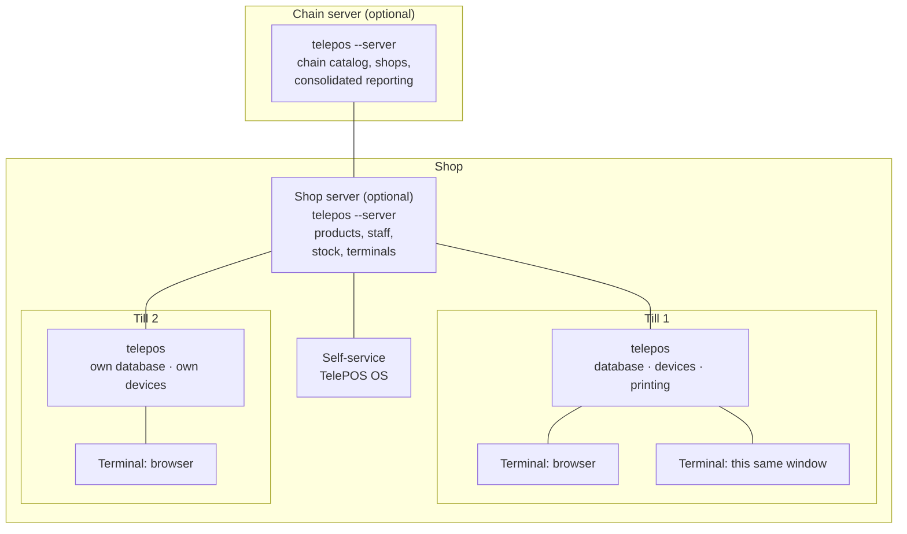
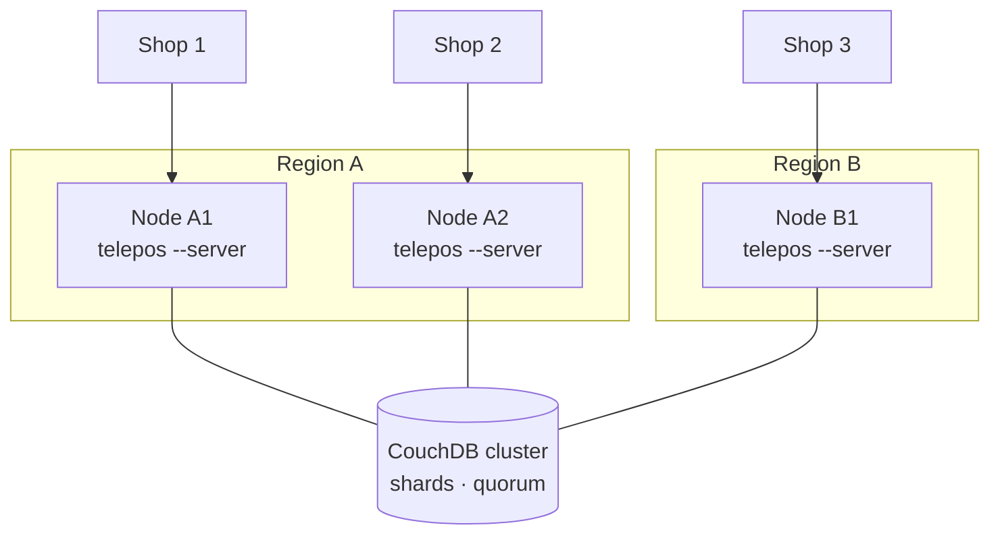
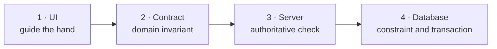
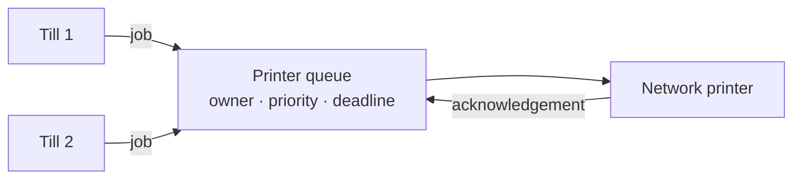
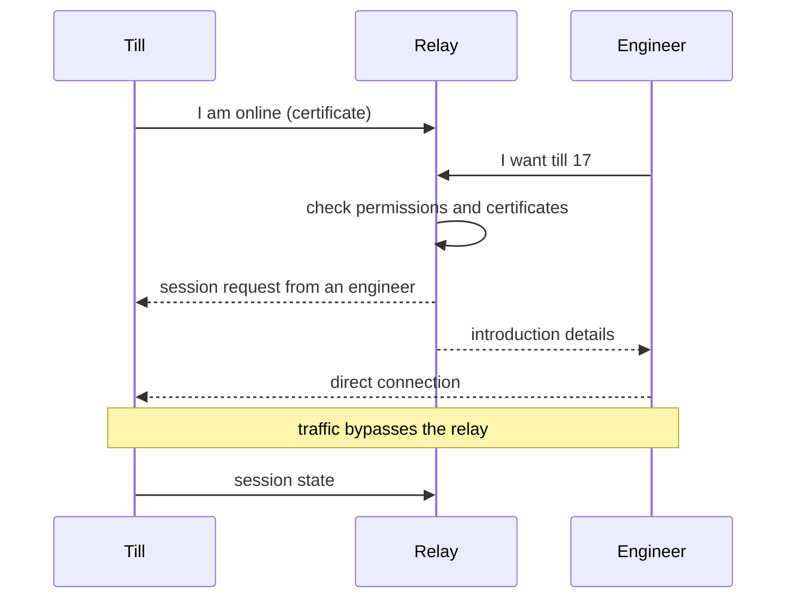
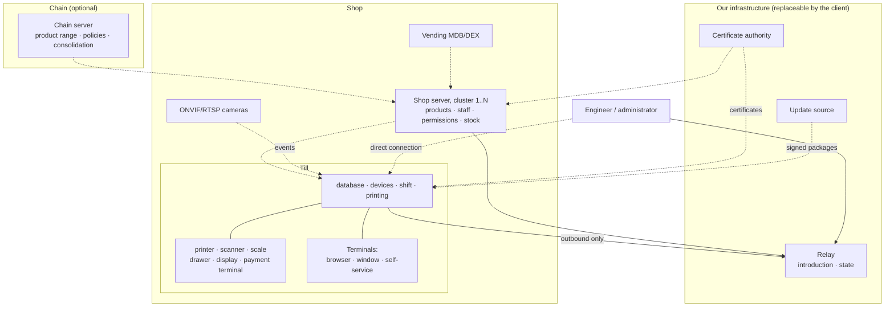
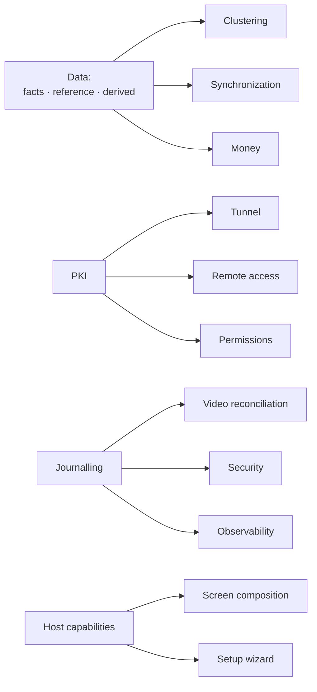

# TelePOS system architecture

Date: 2026-07-30. Status: draft, written section by section.

This document describes the system as a whole: the shapes it takes, what it is
made of, and which rules may not be broken. The refactor is measured against it.

The short rules of day-to-day development live in
[`ARCHITECTURE.md`](ARCHITECTURE.md). Here are the justifications and the
boundaries; if a rule needs a paragraph of explanation, the explanation is here
and the rule is there.

**How to read this.** Every section ends with an **Invariants** block —
statements that must always hold. They can be checked by code and by tests, and
it is they, rather than the prose, that are the contract.

**Searching for an invariant in the code.** Invariants are numbered `I1`–`I153`
here, but the source cites them with a Cyrillic prefix — `И68`, not `I68` — from
the period when this document was written in Russian. The two characters look
alike and are not the same. To find the code behind an invariant, search for the
Cyrillic form: `git grep 'И68'`.

---

## 1. What kind of system this is

TelePOS is a trading system that runs on the till and around it: selling,
refunds, shifts, stock, reports, fiscalization, data exchange.

Three properties determine the whole architecture, and all three are about the
system existing in many instances at once.

**It is offline-first.** The till must sell when there is no network. Not
"preferably" — must: the queue of customers does not wait for the link to come
back. It follows that every point of sale has local state, and that everything
arriving from outside arrives late and may conflict.

**It is multi-instance.** One shop means several tills, several terminals per
till, several shops in a chain. Any decision of the form "one setting per
installation" breaks on the second instance.

**It handles money and is accountable.** A mistake does not cause
"inconvenience" — it causes a till discrepancy, an unissued receipt or a fine.
Correctness therefore outranks development speed, and a complete journal
outranks a compact one.

### What the system does not do

- It is not a cloud service that tills are obliged to reach. Centralisation is
  possible but not required: a single till is a complete installation.
- It does not hold third parties' data and is not a payment operator. Money
  moves through payment terminals and banking services; the system initiates
  and records it.
- It does not replace the operating system. Even on our own image, machine
  management is delegated to a separate privileged daemon rather than to the
  trading application.

---

## 2. Topology: four levels



**A terminal** is a workstation. A screen, a keyboard, the cashier's hands. A
terminal owns nothing: neither a database nor devices. It knows only which
terminal it is, and it talks to the till. A browser tab is a terminal. A
desktop application window is also a terminal, one that merely happens to sit
in the same process as the till.

**A till** is the machine that owns the database and the physical devices. It
prints, opens the drawer, reads the scale, runs the shift. One till serves one
or several terminals.

**A shop server** is the same program in a server role. It owns what is common
to the shop: products, prices, staff, the list of terminals, stock levels. It
has no devices and prints no receipts. It appears when there is more than one
till, or when a common data point is needed; a single till does not need one.

**A chain server** is the same server one level up. It owns what is common to
the chain: the product range, pricing policies, the list of shops, consolidated
reporting.

### Why the levels are optional

An installation of one till is the "till" level and nothing more. An
installation of three tills with no server is three independent tills
exchanging through synchronization. An installation with a shop server has the
tills take shared data from it.

These are not three different products. They are one program with different
contract bindings, and the same sale screen in every case.

### Invariants

- **I1.** A terminal never reaches the database or a device directly.
- **I2.** Any level above the till may be absent. An absent level does not
  switch selling off.
- **I3.** Data owned by a level is modified only at that level. A lower level
  proposes a change rather than performing it.
- **I4.** The screens are the same at every level. The bindings differ, not the
  widgets.

---

## 2a. Server clustering

The server role is not one machine. A shop or chain server may be a cluster,
and for three different reasons that must not be confused: fault tolerance,
load, and geography.



### Three reasons, three different solutions

**Fault tolerance.** A node goes down and the shops keep working. This is
achieved by making nodes interchangeable: a node holds no state that is not in
the database. A client that loses its node reconnects to another and continues
from the same place, because its whole session is described by data rather than
by the node's memory.

**Load.** Reads scale horizontally almost linearly: any number of replicas can
be added. **Writes do not scale** — that is a limit of nature, not of the
implementation. We therefore design so that the heavy things are reads:
reports, catalog, search.

**Geography.** A shop talks to a nearby node. The reason is not load but
latency: a till waiting for an answer from across an ocean is a queue at the
checkout.

### What clusters and what does not

The data model in section 5 settles this in advance.

- **Facts** (sales, movements, payments) cluster freely. Only their creators
  write them, they are not edited, and conflict does not arise. Any node accepts
  them and replicates them.
- **Reference data** (products, prices, permissions) has **one owner per scope
  of visibility**. The chain catalog belongs to the "chain" scope, the shop
  catalog to the "shop" scope. The scope owns it, not the node.
- **Derived data** does not cluster: it is computed in place, on any node.

### Writing reference data in a cluster

Any node accepts a request to change reference data, but it is executed only by
whichever node currently holds the write right for that scope. The right is
taken for a period and renewed; a node that loses connectivity loses the right
when the period expires and stops writing on its own.

This rules out split brain: two administrators in two regions editing the same
price do not create two truths — the second request goes to the owner or is
refused.

**What to do when the owner is unreachable.** Reads continue from replicas and
are marked as possibly stale. A write to that scope is **refused explicitly**,
with a "this cannot be changed right now" message, rather than deferred
silently. A silently deferred reference change is a price that applies an hour
later, when nobody remembers changing it.

Selling does not stop meanwhile: it does not write to reference data.

### The cluster database

CouchDB 3 clusters on its own: sharding, `n` replicas, read and write quorum.
That is its strength, and there is no need to reimplement it.

Our responsibility is not to confuse the levels: the CouchDB cluster decides
**availability and data placement**, while ownership and the write right (above)
are ours to decide. A quorum does not know what "a shop's product price" is and
cannot decide for us who changes it.

### Deployment

The cluster is configured from the interface, like everything else (section 8):
nodes, their addresses, regions, state. Adding a node is an operation in the
interface with a comprehensible result, not an edit to configuration files on
three machines.

A single server is a cluster of one node. There is no separate code path for
"the simple case", or it would drift away from the clustered one.

### Invariants

- **I36.** A cluster node holds no state that is not in the database.
- **I37.** Every reference-data scope has exactly one write owner at any moment.
- **I38.** Inability to write reference data is reported explicitly and
  immediately, not deferred.
- **I39.** The unavailability of any node and any server does not stop selling.
- **I40.** A single server runs the same code as a cluster.

---

## 3. Layers and contracts

The rule already in force in the code, confirmed by the July 2026 refactor:

```
UI          lib/presentation/    screens, widgets, controllers
                  ↓ depends on
CONTRACT    lib/domain/          interfaces, entities, use cases
                  ↑ implemented by
BACKEND     lib/data/            database, synchronization
            lib/hardware/        devices
            lib/telegram/        transport
            lib/backend/         local API serving all of the above
```

**Dependencies point inward. Always.** The UI imports only `domain`. Never
`data`, `hardware`, `telegram`, `drift`, `dart:io` or a plugin.

### Why this is not a matter of style

Verified by measurement. While every screen imported the route table for its
constants, and the table imported every screen, the import graph was a single
lump: the browser build pulled in 656 files out of about 700, together with the
sqlite driver and FFI. After that link was cut and three contracts were
extracted — 52 files and zero layering violations.

So a layer is not about beauty. It is about whether the program compiles for a
second platform at all.

### A contract is what the screen needs, not a table

A bad contract mirrors the database structure: `getProducts`, `getPrices`,
`getStocks`. The screen then makes twenty calls, which is free inside a process
and catastrophic over a network.

A good contract answers the screen's question whole: "what to show on the sale
screen for this terminal". One call, one screen.

### Invariants

- **I5.** A file in `lib/presentation/` does not import `lib/data`,
  `lib/hardware`, `lib/telegram`, `drift`, `dart:io`, `dart:ffi`.
- **I6.** `lib/domain/` does not import Flutter or infrastructure.
- **I7.** Every contract has at least two implementations: local and over the
  network. If the second cannot be written, the contract is stated wrongly.
- **I8.** The entry point owns no screen.

---

## 3a. The native layer: what leaves Dart, and why

This section appeared on 2026-07-31, after the code was measured and the
transports researched. Before that the direction was discussed in words, and
words cannot be checked.

### The boundary follows the seam of the two-layer architecture, not taste

**`dart:ffi` does not exist in the browser.** That is a property of the
platform, not a limitation of our implementation, and it is already fixed by
invariant I5: a file in `lib/presentation/` does not import `dart:ffi`. Hence
the only possible boundary: native code lives **strictly below the contract**,
in the layer that owns the database and the hardware, and the interface knows
nothing about it.

There is one test of any proposal involving native code: **does web still build
afterwards.** If not, the proposal is wrong, however fast it may be.

### Two different justifications, which must not be mixed

**Capability.** What is needed does not exist in Dart at all: there is no QUIC,
and both requests in the SDK tracker are closed as "not planned"; inference
engines are written in C++; real-time control is impossible where a garbage
collector runs. Here native code is justified independently of any measurement.

**Speed.** Here there is **no** justification today. Measured 2026-07-31: the
repository contains zero profiling runs, benchmarks and timings. The single
measurably heavy place — importing a 27 MB product reference of 100 000 items —
is already offloaded to an isolate, and it is the only `compute()` in the whole
application. Cryptography, exchange packing, synchronization loops and receipt
rendering all run on the interface isolate and have never been measured once.

**Hence the rule: before rewriting for speed, move it to an isolate and
measure.** An isolate costs days, a native layer costs months, and without a
number we will speed up what looks heavy rather than what is heavy.

### The list of packages

The packages are published separately (`rk_*` on pub.dev, `rk-*` on GitHub) and
consumed as dependencies. The product is a consumer, not an owner.

| Package | Justification | What it takes over |
| --- | --- | --- |
| `rk_quic` | capability | QUIC and HTTP/3, so the till itself serves WebTransport to the browser |
| `rk_zenoh` | capability | publish-subscribe and query fabric for the tunnel |
| `rk_nats` | capability | NATS and JetStream where a durable message queue is needed |
| `rk_pki` | capability | certificates, mTLS, an installation's own CA instead of hand-written RSA |
| `rk_syslog` | capability | RFC 5424 receiver, RFC 5425 sending, on-disk buffer |
| `rk_infer` | capability | wrapper over a ready C++ engine for vision |
| `rk_devices` | shared code | protocols for scales, displays, drawers, MDB — with their timings |
| `rk_rt` | capability, **later** | manipulator control loop: kinematics, axes, emergency stop |
| `rk_spiffe` | **not decided** | workload identity: `spiffe://` names, SVIDs, Workload API client |

**`rk_spiffe` sits in the table with a caveat, not as settled.** The name was
reserved on 2026-08-01 at the owner's request; there is no content. The reason
for the caveat: SPIFFE overlaps `rk_pki` not at the edge but through the middle
— both answer "who is this machine and why should it be trusted" — and two
identity models side by side are exactly the parallel implementation this
project does not permit. So the choice is binary: SPIFFE **replaces**
certificate issuance in `rk_pki` (and rewrites section 12), or SPIFFE is not
adopted. Separately: the package would be a consumer of the Workload API, which
means a SPIRE daemon on every till. The fork, its cost and the signal for
revisiting are in
`docs/internal/superpowers/specs/2026-08-01-rk_spiffe-design.md`.

### Two packages rejected, one deferred

The design studies of 2026-07-31
(`docs/internal/superpowers/specs/2026-07-31-rk_*-design.md`) concluded against
three of ten. Recorded here so that the proposal does not resurface as new.

**`rk_escpos` — do not build.** All six printing defects are application-logic
errors reproducible in pure Dart, not a missing capability. What is needed is
one shared Dart library instead of four transports with diverging rules. A
separate finding: Kazakh and Kyrgyz letters and the tenge sign have **no
standard single-byte ESC/POS code page at all** — neither CP866, nor CP1251, nor
CP852 contains them, so "pick the right page" is impossible. The only universal
answer is raster rendering, which the project already does for QR codes; the
cost is about 1728 bytes per line against 32–48 as text, so a hybrid is
reasonable.

**`rk_replica` — do not build.** The four synchronization defects are also
application logic: the CouchDB client already reaches every HTTP primitive
required. And more importantly: section 5 reduces synchronization to three
streams with business rules that **no generic replication protocol expresses** —
neither CouchDB, nor PouchDB, nor Couchbase Lite encodes the rule "a disputed
state is never a number". So "replication out of the box" would not have covered
our requirements even if the binding had worked. Plus a trap: JSON numbers are
binary floating point by specification, so naively swapping the store would
bring the money defect back a second time; the existing mapper writes amounts as
strings for a reason.

**`rk_rt` — deferred, not rejected, and the boundary between the two runs
through kinematics.** Predictable timing in **today's** scope is needed by two
cases: MDB (nine-bit exchange frames, a 5 ms window) and stepper drives (a
1.9 µs pulse). Both are solved by a peripheral microcontroller rather than an RT
kernel on the host: `telepos-os` has no RT kernel today, and getting one costs
either a paid subscription on x86 or a self-maintained kernel on the RPi 5.
Assembly at this scale is not justified even on a microcontroller — framing and
pulses are done by a hardware timer and UART under ordinary Rust. MDB and
stepper drives therefore move into `rk_devices`.

**It is deferred because the product is heading towards a robotic site**, and
the study could not establish whether a genuine manipulator is planned: section
9 specifies neither kinematics, nor drive type, nor requirements for safety
interlocks. A manipulator is a different class of problem: several coordinated
axes, an emergency stop, and timing that is no longer about framing bytes.

**Conditions without which the package does not start** — written down so that
it is neither built ahead of its premises nor considered settled:

1. Section 9 names the kinematics, the drive type and the emergency-stop
   requirements. **Partly answered 2026-07-31: a manipulator and a self-service
   point are different devices, and both are planned.** The stepper-driven point
   stays with the microcontroller and in `rk_devices`; the manipulator is the
   subject of this package. What remains is to name the kinematics, the drive
   and the emergency-stop class.

   **And the question that settles everything else: is the manipulator bought or
   built.** An industrial one arrives with its own motion controller — the loop
   is closed inside it, the host sends intents over a bus (EtherCAT, CANopen) or
   through the vendor's API, and then no real time is needed on the host at all,
   and `rk_rt` degenerates into a protocol package and merges with `rk_devices`.
   If the manipulator is assembled from motors and drivers, the loop is ours —
   and conditions 2 and 3 become mandatory rather than desirable.
2. `telepos-os` has an RT kernel and a dedicated processor core (I148) —
   otherwise the scheduler eats the determinism and any code in that loop is
   decorative.
3. A specific computation kernel is named where a predictable cycle count is
   required measurably rather than by general reasoning. Until then assembly
   remains a choice rather than a necessity — and must be called a choice.

**Why printing was nevertheless raised for discussion** — one plan found: a
1000-byte buffer because of which an ordinary fiscal receipt **did not print at
all**; a job resent up to 400 times over a serial line; a short write reported
as a successful print; a status poll that tore the receipt apart mid-write; a
bare `ESC @` cancelling the code page just selected; and CP866, which contains
neither Kazakh and Kyrgyz letters nor the tenge sign — two of five languages
silently turning into question marks.

None of these defects is cured by changing language. Something else cures them:
**one implementation instead of four transports with diverging rules**, an
honest report of a partial write where the device gives one, and code-page
handling that is visible and checkable byte by byte.

### The native build mechanism: an FFI plugin, not a build hook

Decided 2026-07-31 by building a stub both ways, not by preference. The stub is
a Rust crate with a single function returning a version string: it has no
reasons of its own to fail, so anything that failed is the pipeline.

**A Flutter FFI plugin was chosen**, with per-platform build files: CMake for
Windows and Linux, Gradle for Android, podspecs for macOS and iOS. Cargo is
invoked **from** those files; the artifact is placed in the
`<package>_bundled_libraries` list and picked up by the ordinary application
build.

**There is one reason and it is not about taste: on Flutter 3.32.4 stable,
`hook/build.dart` gets the library to zero targets out of six.** The mechanism
is closed by the SDK channel, not unfinished on our side.

Measured:

| What was checked | FFI plugin | `hook/build.dart` |
| --- | --- | --- |
| Windows: cargo to CMake to artifact beside the runner | `rk_probe.dll` built and called from Dart, returned `0.1.0` | `flutter build windows` fails: `Target dart_build failed : Package(s) … require the native assets feature to be enabled` |
| Linux (WSL Ubuntu): the same | `librk_probe.so` in `bundle/lib/`, called, returned `0.1.0` | `dart run` refuses the same way |
| The hook itself as code | — | correct: `testCodeBuildHook` passes on both platforms and emits a valid `CodeAsset` |

The refusal cannot be worked around. `flutter config --enable-native-assets`
**is accepted and has no effect**: `flutter config --list` shows
`enable-native-assets: true (Unavailable)`, and the build afterwards keeps
demanding that what is already enabled be enabled. The cause is in
`flutter_tools/lib/src/features.dart`: `nativeAssets` declares only
`master: FeatureChannelSetting(available: true)`, and
`flutter_features.dart:68` returns `false` when `available == false` **before**
checking the setting and the `FLUTTER_NATIVE_ASSETS` environment variable. Pure
Dart behaves the same: `dart --enable-experiment=native-assets` answers
`Unavailable experiment: native-assets (this experiment is only available on the
main, dev channels, this current channel is stable)`.

Worse than "does not work": **the mere presence of a `hook/` directory in a
package breaks everything that package touches** — `dart run`, `dart test` and
the application build on every platform. The cost of a mistake here is not "one
target failed to build" but "the repository builds nowhere".

#### Android bypasses CMake — a refinement obtained by building an APK

Task 2 predicted friction on Android ("AGP packages what CMake put in
`CMAKE_LIBRARY_OUTPUT_DIRECTORY`, a copy step will be needed") and judged it
fixable. **Checked by building an APK on 2026-08-01: not fixable, and the
failure is silent.** The sequence is as follows.

1. With `project(... LANGUAGES NONE)`, AGP fails at configuration with a bare
   `java.lang.NullPointerException` in `CmakeFileApiV1Kt.readCmakeFileApiReply`:
   it needs a `toolchains` object, and CMake emits one only for a project with a
   declared language. No message, no file, no line.
2. `LANGUAGES C` gets past that wall — and then **the build succeeds and the
   library is not in the APK**. In
   `.cxx/<config>/<hash>/<abi>/android_gradle_build.json` AGP records the custom
   target with an `artifactName` but **no `output` key**: a custom target
   produces no library that CMake could name. AGP asks ninja to build an empty
   list of targets, cargo never runs, and a copy hung off an uncalled target
   cannot fire. Verified by unpacking the APK: 38.9 MB, `libflutter.so` and
   `libapp.so` for three ABIs, no `librk_quic.so`.

Hence: **on Android, cargo is invoked directly from Gradle** (a task in
`android/build.gradle`, the result in `jniLibs.srcDirs`), and
`src/CMakeLists.txt` serves only Windows and Linux, failing with a clear message
if Android reaches it anyway. That is a third path to cargo instead of two — the
price of what works over what looks tidy.

In the same place, by the same means, a mine of the same class was found: if
`x86` is also built, the APK gains `lib/x86/librk_quic.so` in a directory with
no `libflutter.so` — Flutter does not ship 32-bit x86. Android picks the
directory by the device's primary ABI and loads what is in it, so a 32-bit x86
device would choose a directory holding only our library and crash. The default
ABI set must match what Flutter puts there.

**A general rule for the other nine packages: a build that reported success is
not proof. The proof is the unpacked APK.**

**Moving parts, counted against the package actually created:**

| | FFI plugin | `hook/build.dart` |
| --- | --- | --- |
| Build files in the package | 8: `src/CMakeLists.txt`, `windows/CMakeLists.txt`, `linux/CMakeLists.txt`, `android/build.gradle`, `android/settings.gradle`, `android/src/main/AndroidManifest.xml`, `ios/<name>.podspec`, `macos/<name>.podspec` | 1: `hook/build.dart` |
| Entry in `pubspec.yaml` | a `flutter.plugin.platforms` block — five lines | a `native_assets_cli` dependency |
| Targets out of six | six | zero |

An `rk_*` package thereby stops being pure Dart: it gains `flutter:` in
`pubspec.yaml` and a Flutter SDK constraint. The publication gate survives this.

**Fewer parts does not mean fewer demands on the machine.** Hooks remove CMake,
Gradle and podspecs — they do not remove cross-compilation: cargo still needs
the NDK for Android and Xcode for Apple. Verified: `cargo build --target
aarch64-linux-android` builds `librk_probe.so` (263 KB) when the NDK linker is
given through `CARGO_TARGET_AARCH64_LINUX_ANDROID_LINKER`; no mechanism removes
that step.

**What breaks as versions move.** For the plugin, ordinary and visible things:
AGP and `compileSdk` in `android/build.gradle`, the minimum platform version in
the podspec, the minimum CMake version. For hooks, the protocol itself breaks:
on Dart 3.8.1 exactly `native_assets_cli` 0.16.0 resolves, and pub marks it
**discontinued, replaced by `hooks`**; the current version is 0.18.0, and
`native_toolchain_c` is six minors behind (0.13.0 against 0.19.3). A hook
written today will not build against the successor package.

**macOS and iOS — reasoning, not observation: no Mac was available.** Read off
the tooling: Flutter's Podfile templates
(`templates/cocoapods/Podfile-ios-swift:31` and `Podfile-macos:30`) contain
`use_frameworks!`, so a plugin's pod is built as a framework, and Dart opens the
library as `<name>.framework/<name>` — the cargo artifact must land inside the
pod rather than beside it. For that the plugin needs podspecs with a
`script_phase` invoking cargo, plus Xcode, CocoaPods (that is, Ruby) and the
Rust targets `aarch64-apple-darwin`, `x86_64-apple-darwin`, `aarch64-apple-ios`,
`aarch64-apple-ios-sim`. A hook would need exactly the same minus the podspecs —
and still an SDK from the master channel. Neither has been verified here by a
build.

> **Since verified, and expensively.** The first real Apple build, on
> 2026-08-03, found six defects across the packages, including a build script
> that drove to pub.dev with CRLF line endings and exited zero having built
> nothing, a static library with no exported symbols at all, and five of seven
> Dart loaders asking for a `.dylib` that does not exist under
> `use_frameworks!`. The reasoning above was right about the mechanism and
> silent about the failure modes. **An archive can be in perfect order and the
> package still unusable.**

**When to move to hooks — a condition, not an intention.** Exactly one, and it
can be checked by a command: `flutter config --list` stops printing
`(Unavailable)` next to `enable-native-assets` on the pinned Flutter version.
The equivalent in the sources is `stable: FeatureChannelSetting(available:
true)` appearing on `nativeAssets` in `flutter_tools/lib/src/features.dart`.
Until that day, hooks do not appear in the repository even as an experiment: a
`hook/` directory breaks the build for everyone.

### What stays in Dart

- Business logic and money. `Decimal` in Dart is sufficient; the known problem —
  storing amounts in `REAL` columns and aggregating through SQL `SUM` — is
  solved by schema and queries, not by language.
- Reports and aggregation — the same.
- Parsing large reference files — already in an isolate.
- Everything the interface can reach.

### Build verification: five platforms of six, decided 2026-08-01

Automated builds cover **Windows, Linux, Android and web**. **macOS and iOS were
temporarily excluded from verification** — by the owner's decision, until a
machine existed on which they could be built. There was no way around it: they
can only be built on a Mac. That machine arrived on 2026-08-03 and the exclusion
has since been lifted.

Duties follow from that decision, not merely conveniences:

- No `rk_*` package **claims** macOS and iOS support as verified. Where a build
  has never run, that is written in the package's `README`, not only in a report
  nobody will open twice.
- The raised minimum versions found during the first Apple build (iOS 12 and
  macOS 10.14/11 drop out) remain an **unverified claim** until the first real
  build. It is recorded because it was discovered, not because it was confirmed.
- When the machine appears, the very first build of those two targets counts as
  a finding rather than a formality: four of six platforms had never been built
  automatically before 2026-07-31, and each gave two or three genuine defects on
  the first attempt.

### Invariants

- **I143.** No `rk_*` package is imported from `lib/presentation/`. Web builds
  after any change to the native layer, and this is checked by building it.
- **I144.** A native library's failure is returned as a value; it neither kills
  the process nor escapes as an exception out of somebody else's stack.
- **I145.** No call into native code runs on the interface isolate.
- **I146.** Memory allocated natively is freed deterministically: Dart's garbage
  collector does not know about it.
- **I147.** Enumerations cross the FFI boundary **by name**, never by ordinal.
- **I148.** A real-time block runs only where there is an RT kernel and a
  dedicated processor core; on other installations it is absent rather than
  silently degraded.
- **I149.** Rewriting for speed requires a measurement **first**; rewriting for
  capability requires a justification that Dart lacks it.
- **I150.** All `rk_*` packages build their native part by **one** mechanism —
  a Flutter FFI plugin with per-platform build files. No package contains a
  `hook/` directory while `flutter config --list` prints `(Unavailable)` next to
  `enable-native-assets`. Checked thus: there is no `hook/build.dart` anywhere
  under `packages/`, and every package with a native part has a
  `flutter.plugin.platforms` block.
- **I151.** A native library counts as having reached Android only when it is
  found **inside the built APK** (`lib/<abi>/lib<name>.so`), not when Gradle
  reported success. The ABI set matches what Flutter puts there: an ABI
  directory holding our library without `libflutter.so` will crash the
  application on a device of that ABI.
- **I152.** A certificate has **one representation** across all `rk_*` packages —
  `rustls_pki_types::CertificateDer`; PEM is only a carriage form across the FFI
  boundary. **Only** `rk_pki` may issue certificates: two packages able to sign
  is an installation with two certificate authorities that nobody chose between.
- **I153.** A transport session has a named silence limit, and the value "never"
  does not exist. Measured: without `max_idle_timeout` the server had not
  noticed a departed client twenty seconds later, so a peer that vanished
  without a close — a browser closed by the system, a lowered lid, a lost Wi-Fi —
  would hold the session indefinitely.

---

## 4. Host roles and capabilities

There is one program, but it starts in four guises. The guise determines not a
set of screens but a set of capabilities.

| Role | Started as | Window | Owns the DB | Owns devices | Manages the machine |
| --- | --- | --- | --- | --- | --- |
| `browser` | `main_web.dart` | a tab | no | no | no |
| `desktop` | `telepos.exe` | yes | yes | yes | no |
| `appliance` | `telepos --kiosk` | no, full screen | yes | yes | **yes** |
| `server` | `telepos --server` | no | yes | no | depends |

### Capabilities instead of an enumeration

A screen does not ask "am I a kiosk?". It asks "does anybody here manage the
network?".

```dart
class HostCapabilities {
  final bool managesNetwork;    // Wi-Fi, Ethernet — here, not in the client's OS
  final bool canInstallDrivers; // package catalogue through telepos-sysd
  final bool controlsDisplay;   // brightness, rotation
  final bool managesTime;       // time source and NTP
  final bool ownsDevices;       // devices are attached to this machine
  final bool ownsData;          // the database lives here
  final bool servesTerminals;   // serves the API to others
}
```

The difference is fundamental. With an enumeration, adding a fifth guise means
editing every `switch` in the program; in six months that is twenty places, and
one of them will be forgotten. With capabilities it is one new constant.

**`appliance` is not guessed.** Probing the `/run/telepos/sysd.sock` socket
answers "is there a daemon", not "am I the appliance": the daemon may also be
installed on ordinary Linux. The role is declared by a startup flag.

### What follows for setup

A wizard step is shown if it applies to the host's capabilities, not because it
happens to be seventh in the list.

- Network — only under `managesNetwork`. In the browser and on the desktop the
  network is configured by the client's operating system, and our screen there
  would be permanently inert.
- Drivers — only under `canInstallDrivers`.
- Display brightness and rotation — only under `controlsDisplay`.
- Time and NTP — only under `managesTime`.

Devices are configured in every guise, the browser included: the browser
configures the devices of **the till** it is attached to, and the list of ports
and discovered devices arrives from the till over the API. A thin terminal does
not mean "no hardware" — it means "the hardware is not mine".

### This does not contradict the rule that screens are the same everywhere

[`ARCHITECTURE.md`](ARCHITECTURE.md) requires that if a screen exists in one
binding and is absent in another, the split was made wrongly. That is about the
**binding**: the sale screen must work in the browser and on the desktop alike,
because what differs should be contract implementations, not the set of widgets.

Here we are talking about a **host capability**: the Wi-Fi settings screen is
absent from the browser not because nobody got round to porting it, but because
the browser has no Wi-Fi that we manage. The difference is checkable: a screen
missing because of a binding is unfinished work; a screen missing because of a
capability is correct behaviour, and it must be described in the capability list
rather than decided inside the screen's code.

### Invariants

- **I9.** No screen checks the host role directly. Capabilities only.
- **I10.** The role is declared by the entry point and does not change while the
  process runs.
- **I11.** An unavailable capability means the screen is absent, not that it is
  present and showing an error.
- **I11a.** An absent screen is justified either by a missing capability or by
  unfinished porting, and the two cases are distinguishable.
- **I140.** A terminal's identity belongs to the window, not the machine: two
  tabs against one till are two terminals, until the operator binds them into
  one.

---

## 5. Data: ownership, transactions, synchronization, conflicts

### Ownership

Every unit of data has exactly one owning level. The owner is the one who
changes it; the others read and propose.

| Data | Owner | Why |
| --- | --- | --- |
| Sale, payment, refund, shift event | the till | They arise where the customer is standing. After closing they do not change. |
| A terminal's devices, a terminal's name | the till | Physically bound to the machine. |
| Products, prices, categories | the highest level present | Common to the shop or the chain. |
| Staff and permissions | the highest level present | A cashier must not be created twice. |
| Stock levels | see below | The one genuinely contested place. |
| Fiscalization settings | the till | Bound to a specific fiscal register. |

"The highest level present" means: if there is a chain server, it; if not but
there is a shop server, it; if neither, the till.

### Why CouchDB solves a different problem from the one people imagine

CouchDB gives replication and a revision tree. It guarantees that replicas
**converge to one state**, and that a conflict will be **detected and
presented**. It does not guarantee that they converged to the *correct* state:
on conflict it deterministically picks a winner, and the losing revision stays
sitting in the document.

For money that is not enough. If two tills simultaneously wrote off the last
unit of an item, "convergence" means one of the two write-offs quietly
disappears — while the goods physically left twice.

The conclusion that determines the data model: **contested state must not be
stored as a number.**

### The rule of a journal instead of a number

Stock is not a "how much is there" field but the sum of movements: receipt,
sale, write-off, transfer, stocktake. Each movement is a separate document,
created once and never edited.

Then conflict does not exist by construction: two documents created by different
tills do not conflict — they simply both exist. Stock is computed rather than
stored (with materialisation for speed, but materialisation is derived and can
always be recomputed).

The same rule applies to everything two parties can change: the shop's cash
balance, a discount limit, a customer's bonus balance.

### What is synchronized, then

- **Facts** (movements, sales, payments, shift events) — append only, replicated
  both ways, never conflict.
- **Reference data** (products, prices, staff) — edited at the owning level,
  replicated downwards, read-only below. Conflict is impossible because there is
  one writer.
- **Derived data** (stock, reports) — not synchronized at all. Computed locally
  from facts.

If a document falls into none of the three categories, the data model is wrong,
and the model is what must be redone — not conflict resolution written on top.

### Transactions

A transaction is local and covers one business operation whole. "Sale complete"
means the receipt, its lines, the payments, the stock movements and the receipt
number, all in one database transaction. There can be no half of it.

**There are no distributed transactions.** Between machines an outbox queue
does the work: the operation is written locally in one transaction together with
its queue entry; sending happens afterwards and may be retried. The receiver
must be idempotent (section 7).

Two-phase commit between till and server is deliberately not used: it requires
both sides to be alive, and the whole system is built on the second side
possibly being absent for hours.

### Invariants

- **I12.** Every document type has its owning level recorded.
- **I13.** A fact document is neither modified nor deleted after creation.
- **I14.** Contested state is not stored as a number but computed from facts.
- **I15.** One business operation, one database transaction.
- **I16.** The outbox entry belongs to the same transaction as the operation
  itself.

---

## 5a. Backup and restore

A gap found by a completeness check: the document said nothing about backups,
although that is the only defence against losing the database, and the database
is every sale the shop has made.

### What is backed up

- The till's database in full: sales, movements, shifts, settings, devices.
- The server's database: reference data, permissions, terminals.
- Key material — **separately and under different rules**: a machine's private
  key is not backed up at all (section 12); a lost machine gets a new
  certificate.

### Rules

**A backup is verified by restoring it.** An unverified copy is not a backup but
a hope. Restoring onto a clean machine must be a routine procedure, not
something done for the first time on the day of the failure.

**A backup is consistent.** The database must not be mid-transaction when it is
copied. For SQLite with a write-ahead log that means: checkpoint the log first,
then copy, and do not copy the `-wal`/`-shm` files as they are. The rule was
derived in practice in this project, and breaking it corrupted a database.

**A backup is encrypted.** It contains every sale and every piece of the shop's
personal data. A stolen backup equals a stolen database.

**A backup is stored somewhere other than the database.** A copy on the same
disk protects against file corruption and against neither a stolen machine nor a
failed disk.

### Recovery objectives

The numbers are set by the installation's owner, but they must be set, otherwise
there is nothing to discuss:

| What | Meaning | Sensible default |
| --- | --- | --- |
| Acceptable data loss | how much work may be lost | no more than one shift |
| Recovery time | how long the shop may stand idle | hours, not days |

### What already exists and what is missing

The system can restore from a Telegram backup at first launch. That is a special
case rather than a policy: it covers neither scheduling, nor verification, nor
encryption, nor server databases.

### Invariants

- **I97.** A backup is taken on a schedule, not from a person's memory.
- **I98.** A backup is taken from a consistent database state.
- **I99.** A backup is encrypted and stored away from the source machine.
- **I100.** Restoring is verified regularly, not at the moment of failure.
- **I101.** Machines' private keys never enter a backup.

---

## 5b. The limits of offline operation

A second gap: section 1 declares that the till must sell without a network, but
nowhere does it say **for how long** and what happens at the boundary.

### Why the boundary exists

It is not ours: fiscal legislation sets it. In most countries the offline
operation of a fiscal register is limited to a period after which receipts must
have been transmitted to the operator, or the sale becomes illegal.

Autonomy is therefore not "indefinite" but "until a deadline, with warning in
advance".

### Behaviour as the boundary approaches

1. **Normal.** Network present, queue empty, nobody notices anything.
2. **Offline.** No network, receipts accumulate, trade continues. The interface
   shows what has accumulated and how much time is left.
3. **Warning.** The deadline is near. The warning is addressed to the owner
   rather than the cashier: the cashier cannot repair the internet.
4. **Boundary.** Selling stops, because beyond it selling is illegal. This is
   the only case in the whole document where selling stops deliberately, and it
   must be as explicit as every other refusal.

The difference between the third and fourth states is critical: there must be
enough time between them for a person to react. The threshold is set by the
country (section 20), not by a global constant.

### The same for the permissions server and the shop server

Section 11 says that permissions are cached and selling is not blocked. The same
principle holds here: the cache has a lifetime, after which privileged actions
become unavailable while selling continues.

### Invariants

- **I102.** The offline deadline is determined by the country, not by a global
  constant.
- **I103.** Approaching the deadline warns the owner in advance.
- **I104.** Stopping the sale on reaching the deadline is the only deliberate
  stop of selling in the system, and it is explained to the operator.

---

## 6. Validation at four levels

One rule is checked four times along the path of the data. This is not
duplication — the levels answer different questions and protect against
different things.



**1. UI — instant and offline.** The field turns red while the person is still
typing. This level's job is to stop the error going further than the hand, not
to guarantee correctness. It works without a connection, and therefore cannot be
authoritative.

**2. Contract — domain invariants.** A draft that breaks a rule cannot be
assembled: the object simply does not construct. This level's job is to make an
invalid state unrepresentable, so that code further along need not check for it.

**3. Server — the authoritative check.** Never trusts the client. Checks
everything the UI checked, plus what the client cannot know: whether the number
is taken, whether this terminal has the right, whether the shift is closed. The
only level whose "no" is final.

**4. Database — constraints and transactions.** Uniqueness, foreign keys, CHECK,
isolation. The last line against a bug in the code above. This is where races
are caught that none of the previous levels could see.

### The rules without which this turns to mush

- **No level is skipped "because the one above already checked".** The server
  checks what the UI checked. The database checks what the server checked.
- **One error text across all levels.** Messages live in one place and are
  identified by code, not by string. Otherwise the same violation looks like
  three different things depending on where it was caught.
- **Level 3 must be able to reject what passed levels 1 and 2.** If it cannot,
  the client is being trusted — and it must not be: the client may not be our
  browser.

### Invariants

- **I17.** Every validation rule has a code and is represented at all four
  levels.
- **I18.** The server does not accept data on the grounds that the client
  checked it.
- **I19.** A violation caught by the database is a defect in the code above, and
  is journalled as a defect rather than as a user error.

---

## 7. Money

The section about where a mistake costs most.

### Precision

`Decimal`, precision 18, scale 3. Never `double` — in no layer, transmission
over the network included: a JSON number is a double, so amounts travel as
strings.

### Receipt numbering

A receipt number belongs to the **till**, not to a terminal and not to a server.
Two terminals of one till take numbers from one counter; the number is issued
inside the same transaction as the sale itself.

There is no global end-to-end numbering across a chain of shops, and there will
not be: it would require the centre to be reachable at the moment of sale, and
the sale must work offline.

### Idempotency

Every money operation carries an idempotency key created by the initiator before
the first attempt. Repeating a request with the same key returns **the result of
the first attempt** rather than performing the operation again.

This applies to: taking a payment, making a refund, sending a receipt to the
fiscal operator, cash in and cash out. Without it any network timeout becomes a
double charge, and any till reboot in the middle of a payment becomes a lost
one.

### Payment and a broken link

The dangerous place is not "the payment failed" but "it is unknown whether it
succeeded". The terminal answered late or did not answer at all — the state is
undetermined.

The rule: an unfinished payment does not disappear. It stays in a "being
established" state and is resolved either by polling the payment terminal or by
end-of-day reconciliation, but never by assumption. The cashier sees an explicit
"being established", not a blank screen.

### Printing and fiscalization do not block the money

The order is: money taken → receipt committed to the database → printing and
submission to the operator queued. Printing is not awaited synchronously.

This has been fixed once already: a missing `/dev/usb/lp*` cost about 2.8
seconds *after* the money had been taken. Such behaviour is inadmissible in
principle, not in one particular case.

### Non-fiscal mode

A first-class mode, not a degradation. There are sites and countries where a
fiscal register does not apply. In this mode a receipt is composed, numbered and
stored exactly as otherwise; it simply does not go to an operator. The code must
contain no branches of the form "if there is no fiscalization, then somehow".

### Invariants

- **I20.** No amount anywhere is represented by a floating-point type.
- **I21.** The receipt number is issued inside the sale transaction and is
  unique within the till.
- **I22.** A money operation without an idempotency key is not accepted.
- **I23.** A repeat with the same key does not create a second operation.
- **I24.** Taking money awaits neither printing nor the fiscal operator.
- **I25.** A payment with an unknown outcome is stored explicitly and cannot be
  silently forgotten.

---

## 7a. Operations between tills and terminals

A gap found by walking the money edge cases. A receipt was printed at till 1 and
the customer comes to till 2 to return the goods. A deferred sale was started on
one terminal and continued on another. A shift was opened on one terminal and is
being closed on another.

### The rule: a refund is a new fact, not an edit of an old one

Section 5 forbids modifying facts. A refund does not edit the sale — it creates
its own document referring to the original receipt by identifier. The owner of
the refund becomes the till **on which it was made**, not the one that sold.

A requirement follows: the original receipt must be **findable**. With a shop
server present, receipts are visible across the shop; without one, only what has
replicated so far.

### When the original receipt is unavailable

The honest answer: the operation is refused with an explanation, not performed
on a guess. A refund without an original document is a separate operation, a
separate permission and a separate audit record, and it is allowed only where
the country permits it and the owner has decided so.

A silent "we will refund it somehow" is how goods get returned twice.

### What belongs to the terminal and what to the till

| Operation | Owner | Who may continue it |
| --- | --- | --- |
| Shift | the till | any terminal of that till |
| Deferred sale | the till | any terminal of that till |
| The current unfinished sale | the terminal | only that terminal |
| Table or order (restaurant) | the till | any terminal, by explicit handover |
| Refund | the till where it is performed | — |

The rule is simple: if an operation can be continued from elsewhere, it belongs
to the till; if not, to the terminal. An unfinished sale is bound to a terminal
because the customer is standing at that one.

### Invariants

- **I105.** A refund is a separate document referring to the original; the
  original is not modified.
- **I106.** A refund with no original document found is a separate operation
  with a separate permission.
- **I107.** An operation continuable from another terminal belongs to the till,
  not to the terminal.

---

## 8. Devices

### A device class, not a model

The system knows classes: receipt printer, label printer, scanner, scale, cash
drawer, customer display, payment terminal, note acceptor, coin mechanism,
camera. The class states what the device can do; the model states how to talk to
it.

This is not an invention: the industry formalised such a model in
[UnifiedPOS](https://www.omg.org/retail/unified-pos.htm) (NRF-ARTS/OMG), with
[OPOS](https://en.wikipedia.org/wiki/OPOS) and JavaPOS as its platform-specific
implementations. We are not obliged to implement the specification in full, but
we are obliged to reproduce its central property: **changing a device model must
not be programming.**

In practice that means the system holds:

- a list of classes with a description of each class's capabilities;
- a list of **profiles** — "printer, ESC/POS protocol, 80 mm width, cuts paper",
  "scale, CAS protocol, serial port";
- a binding: "this terminal, this class → this profile, these connection
  parameters".

**A profile declares which connection parameters its protocol needs**, and the
binding supplies them. This refinement arrived during implementation on
2026-07-30: a single "address" field is not enough — a payment terminal needs a
host, a port, a merchant identifier and a key, while a serial scale needs only a
port name. Listing those fields in the binding would return model specifics to
the very place they were being removed from. Validating a binding demands
exactly the parameters the profile declared — a missing parameter is rejected
rather than silently accepted.

**Not everything configured next to a device belongs to it.** At the same time
it emerged that the minimum and maximum barcode length were stored among the
scanner's settings, although a scanner reads any code alike: that is a rule for
validating what was read, which is to say an installation business rule. The
test: if a parameter does not change the conversation with the device, it is not
a property of the device.

A new printer model speaking ESC/POS is an entry in the profile list, not a
branch in the code. A model speaking its own protocol is a new driver, and there
should be few of those.

The de-facto standards we rely on: **ESC/POS** for receipt printers, **ZPL/EPL**
for label printers, **ONVIF/RTSP** for cameras (section 10), and **MDB** and
**DEX/EVA-DTS** for unattended points (section 9).

### Everything is configured from the interface

The requirement was stated directly by the product owner: no configuration
files, up to and including the engineering parts. From the UI one configures:

- device discovery: the list of ports, USB devices, discovered network printers,
  paired Bluetooth devices — with a "search again" button;
- verification: "print a test receipt", "open the drawer", "take a weight",
  "grab a camera frame" — right on the settings screen, with a visible result;
- protocol parameters: paper width, port speed, code page, cut command set;
- state: connected, out of paper, cover open, not responding.

The list of ports and devices comes **from the machine where they physically
are**. A browser terminal receives it from the till over the API — otherwise
configuring hardware from a browser is impossible, and we decided it is
possible.

### Multi-till mode: printers are networked

This is not a recommendation but a condition of operation.

**A USB printer physically belongs to one machine.** You cannot reach across a
network to somebody else's USB bus. So in an installation where one machine
serves several tills, the printers are networked.

**Each till configures strictly its own set** — its own printer, its own
scanner, its own scale, its own drawer. Overlapping sets are not supported: two
cashiers printing to one printer with no ordering rules get interleaved
receipts.

### A shared printer is a queue, not shared access

The qualification matters, and it is what makes sharing possible.

The printer receives **data that is already fully composed**: the receipt was
assembled on the till, passed through the fiscal operator, and carries its time,
its fiscal sign and every attribute. The printer decides nothing — it prints a
finished byte stream.

So a shared printer is not a shared device but a **job queue**:



Queue rules:

- a job has an owner — the terminal and till it came from;
- a job is indivisible: a receipt prints whole, and no other receipt can wedge
  itself between its lines;
- a job is idempotent: a retry after a timeout does not print a second receipt,
  because the job has an identifier and the print service remembers the
  acknowledged ones;
- a job has a deadline: an unprintable job does not hang forever but becomes a
  visible problem;
- a printing failure does not cancel the sale — the money is already taken and
  the receipt already exists.

The default meanwhile stays as it was: **one printer per till**. The queue is a
possibility, not an obligation, and it must not complicate the typical
installation.

### Health and hot-plugging

A device may vanish at any moment: a cable pulled, power switched off, a network
lost. That is a normal state, not an exceptional one.

- Each device's state is polled and stored, rather than discovered at the moment
  of use.
- A device's disappearance is visible in the interface before the cashier tries
  to use it.
- A device's appearance is detected without restarting the program.
- A missing device never blocks the taking of money.

### Invariants

- **I26.** The UI does not address a device. Only a contract.
- **I27.** A device set belongs to a terminal, not to an installation.
- **I28.** In a multi-till installation the printer is networked.
- **I29.** A print job is indivisible and idempotent.
- **I30.** No device failure blocks the taking of money.
- **I31.** Everything configurable is configured from the interface. A
  configuration file is not a supported means of configuration.
- **I141.** A profile declares its required connection parameters; a binding
  missing a declared parameter is rejected.
- **I142.** A parameter that does not affect the conversation with a device is
  not stored among its settings.

---

## 9. Point-of-sale modes

The machine class answers "what are we running on". The point mode answers "who
uses it and how". These are independent dimensions: self-service happens both on
our own image and in a browser.

### Cashier

The ordinary mode. A person is at the terminal, responsible for the shift, the
refunds and the drawer.

### Self-service

A customer is at the terminal. The differences are not cosmetic:

- **Permissions.** Selling and printing are allowed. Opening the drawer, closing
  the shift, making a refund, editing a price are not. This is not an interface
  setting but the terminal's permissions (section 11): a hidden button is not a
  defence.
- **Security scale.** An industry technique: an item placed in the bagging area
  is weighed and compared against the expected weight. A discrepancy is a signal,
  not a prohibition.
- **Age confirmation.** A restricted item halts payment and calls a member of
  staff.
- **Calling staff.** Mandatory, and it must work even when everything else has
  broken.
- **Interface.** Larger, fewer options, no service screens. The same contracts, a
  different composition.

### Vending and unattended points

A machine with no person. Here the industry is standardised and there is no need
to invent our own:

- [**MDB**](https://vapetm.com/blogs/vape-vending-machines-usa/nayax-mbd-and-advanced-troubleshooting)
  (NAMA) — how a machine's controller talks to the coin mechanism, note acceptor
  and cashless module. Payment itself and its details — amount, item, time —
  travel over MDB.
- **DEX/EVA-DTS** — audit and telemetry export: what was sold, what ran out,
  what failures occurred.

A vending machine is a till without a terminal: it has devices and it has sales,
but no cashier screen. Every money rule (section 7) applies unchanged.

### Robotic checkout and unattended scales

A point where goods are weighed and paid for with no cashier: a weighing
counter, self-service packing. It needs what vending needs, plus metrology.

**Metrology is a separate requirement.** Scales used in trade are verified,
sealed, and carry a verification number and an expiry date. The system must hold
those details and show when the date runs out; printing a weight taken from an
unverified scale is a violation.

### The kitchen screen

Restaurant mode exists already; its other half does not. The cook's screen
receives order lines, marks them ready and returns the state to the floor. It is
a terminal without money: it does not sell, does not print receipts and does not
see amounts.

### How the mode is set

The mode is a property of the **terminal**, not of the build. One and the same
executable, started on two machines, gives a cashier and a self-service point,
because that is how their terminals are configured. It is configured from the
interface, stored on the till, and affects both permissions and screen
composition.

### Invariants

**An unknown mode.** A mode value the system does not know — written by a newer
version and read after a rollback, or corrupted — is not coerced to the nearest
known one. Coercion would silently **raise privilege**: a self-service terminal
would become a cashier's. The rule: an unknown mode forbids privileged actions
and remains a visible problem, but does not deprive the terminal of the ability
to sell.

A note from the implementation (2026-07-30): in the first version of the
terminal contract an unknown mode throws. That protects privilege but stops the
terminal entirely, which contradicts I39. The correct behaviour — forbidding
privileged actions — is implementable only together with permissions, and is
therefore fixed in the permissions plan rather than earlier.

- **I32.** The point mode is a property of the terminal, set from the interface.
- **I33.** Mode restrictions are implemented by permissions, not by hiding
  buttons.
- **I34.** Money rules are identical in every mode, vending machines included.
- **I35.** A weight from a scale whose verification has expired does not reach a
  receipt.
- **I139.** An unknown point mode forbids privileged actions and is not coerced
  to the nearest known one.

---

## 9a. Reporting, accounting and closing a period

A gap found by walking through the cast of characters: the document had no
accountant and no auditor, and they are the ones the system ultimately counts
for.

### One arithmetic

A report **does not count money differently from the till**. If a shift total in
a report and on the till are arrived at by different means, they will diverge,
and working out which is right will take a week. The arithmetic lives in one
place in the domain (section 3) and is used by everyone.

### Reconciliation

Three reconciliations, each mandatory:

- **Cash**: what was counted in the drawer against what was computed. A
  discrepancy is a fact to be recorded, not adjusted away.
- **Card**: the terminal's totals against the bank's day totals. This is where
  payments with an unknown outcome (section 7) are discovered.
- **Fiscal**: what was sent to the operator against what we recorded.

### Closing a period

A closed period does not change. That is an accounting requirement rather than
our convenience: otherwise a report filed yesterday becomes a different report
tomorrow.

Editing after the fact is impossible; a correction is issued as a document in
the current period referring to the original. This is the same rule as for
refunds (section 7a) and for facts (section 5) — one rule, three applications.

### Export

Totals are exported to the client's accounting systems in a documented format.
Export is a read, so it scales and may run on any node (section 2a).

### Invariants

- **I108.** Money arithmetic is implemented once and used by reports and till
  alike.
- **I109.** A closed period does not change; a correction is a new document.
- **I110.** A reconciliation discrepancy is recorded as a fact rather than
  removed by adjustment.

---

## 10. Video and events

### The value is not in the video

Any video recorder can record video, and there is no point building our own. The
value appears when video is **correlated with till events**. The industry calls
this
[exception-based reporting](https://www.marchnetworks.com/intelligent-ip-video-blog/enhance-pos-exception-based-reporting-with-integrated-video/)
and it is among the most widely used loss-prevention tools.

The system catches a discrepancy and shows **those three seconds of video**,
instead of inviting a person to watch a whole shift:

- an item put into a bag but not scanned;
- a void or refund with no physical return of goods;
- a manual discount or price change;
- the cash drawer opened with no sale;
- a line cancelled after weighing;
- a security-scale discrepancy at self-checkout (section 9).

### Cameras — by standard

Connection only through **ONVIF/RTSP**. This lets us work with cameras already
installed and does not tie the client to a manufacturer. Proprietary protocols
only where unavoidable, and then as a separate driver, as with devices
(section 8).

### Visitor counter

A separate and independently useful thing: visitors per hour against receipts
per hour gives conversion, and conversion is the only figure that shows what is
being lost *before* the till rather than *at* it. Plus hourly load, from which
the staff rota is built.

### What we store

We do not store the video. The video recorder or the camera cloud stores it; our
system stores a **reference**: which camera, which moment, what duration, which
event it relates to. Video is fetched on demand.

The reason is not saving space but responsibility: video is personal data
(section 20), and the fewer places it lies in, the smaller the risk surface.

### What this demands of the rest of the system

Correlation is only possible if till events carry **accurate and trustworthy
time** (section 7 on fiscal time, section 17 on the time source) and if the
event stream is complete (section 15 on journalling). Video reconciliation is a
consumer of the event journal, not a separate subsystem with a log of its own.

### Extensibility

A video-analytics vendor is a replaceable contract implementation, just like a
device. Today that is an ONVIF camera with our own counter; tomorrow it may be
somebody else's system that recognises more. The contract describes events
("a visitor entered", "an item was not recognised"), not who produced them.

### Invariants

- **I41.** The video stream does not pass through our system; a reference to the
  moment is stored.
- **I42.** A till event participating in reconciliation carries a trustworthy
  timestamp.
- **I43.** The video and analytics vendor is a replaceable contract
  implementation.

---

## 11. Permissions: RBAC and visibility scoping

### The subject is not only a person

A permission is checked against a pair: **who** (the user) and **from where**
(the terminal). A device is a full subject of permissions, not merely the place
a person is sitting.

The central property of self-service follows: a self-service terminal cannot
open the drawer even if the director has signed in on it. The effective
permission is the **intersection** of the user's and the terminal's, not one of
them.

```
permission = user role permissions ∩ terminal permissions ∩ mode restrictions
```

### Visibility scoping

Permissions answer "what may be done"; visibility answers "what exists at all
for this subject".

- A shop does not see another shop's data.
- A till does not see another till's sales unless allowed to.
- An employee sees their own shifts; a supervisor, their shop's; the owner, the
  chain's.

**Implemented at the data level, not the interface level.** A restriction made
by a filter in the UI is bypassed by calling the API directly — and our API is
public by design (section 3). Every query runs within the subject's visibility
scope, and data outside the scope is not returned rather than "returned and
hidden".

### Where permissions live

The model is the same for every installation; the storage location differs.

- A single till — permissions on the till.
- With a server — permissions on the server, tills fetch and cache them.
- With a chain — on the chain server, shops inherit and may narrow but not
  widen.

Narrowing downwards is allowed, widening is not. Otherwise a shop grants itself
permissions the chain never gave it.

### Working without a connection

The till caches permissions and works from the cache when the server is
unreachable. The cache has a lifetime: once it expires the till keeps
**selling** but does not perform privileged actions requiring confirmation from
the centre. Selling is never blocked by the absence of a permissions server.

### Supervisor confirmation

An ordinary thing in retail: the cashier cannot make a refund but can call a
supervisor, who confirms the operation with their own account. Requirements:

- the confirmation is limited by time and by operation — it does not put the
  shift into an "anything goes" mode;
- the confirming party is recorded in the journal separately from the cashier;
- remote confirmation (a supervisor confirming from their own terminal) is the
  same mechanism, not a separate one.

### Emergency access

The situation "everything is broken and we must trade" exists and must be
provided for, or it will be solved by a workaround. Emergency access:

- is limited by time;
- is journalled as a security event at the highest level of attention;
- raises a notification to the owner rather than a quiet record.

### Invariants

- **I44.** A permission is checked on the server. The interface hides what is
  unavailable for convenience, but is not a defence.
- **I45.** The effective permission is the intersection of the user's, the
  terminal's and the mode's.
- **I46.** Visibility scope is applied when selecting data, not when displaying
  it.
- **I47.** A lower level may narrow the permissions it received but not widen
  them.
- **I48.** The absence of a permissions server does not stop selling.
- **I49.** Supervisor confirmation is limited by operation and time and is
  journalled separately.

---

## 12. Machine identity and PKI

The tunnel and remote access sections (13 and 14) rest on machines being able to
prove who they are. That is a subsystem of its own, and without it the rest is a
wish.

### Every machine is a subject with a certificate

The till, the server, a cluster node — machines with a native layer
(section 3a) — have their own key pair and certificate: `rk_pki`,
`MachineIdentity` (`packages/rk_pki/lib/src/machine_identity.dart`). The
certificate attests which machine this is, which installation it belongs to, and
what role it has.

The private key **does not leave the machine** and is kept in the operating
system's key store where one exists. Key export does not exist as a capability.

### The browser terminal — a secret instead of a certificate

The terminal is not covered by the rule above: a browser tab has neither a key
pair nor a certificate, and this is not a gap but a consequence of how the
platform is built. A machine key lives on one side of the FFI boundary of a
native package (section 3a); a browser tab is pure Dart/JS inside the page
sandbox, and it does not hold FFI keys and cannot: a web page has no access to
the operating system key store in which `rk_pki` keeps a machine's private key.
Giving a terminal "its own" certificate would leave nothing to attest it with
and nowhere to store it.

Instead of a key pair, the till issues the terminal a **shared secret** at
enrolment — 256 random bits (`TerminalSecret.generate()`,
`lib/domain/terminal/terminal_secret.dart`). The till stores not the secret
itself but only its fingerprint (`Terminals.secretFingerprint`, schema migration
v35→v36); only the terminal holds the value. On every new connection the
terminal presents the secret back, the till compares it against the fingerprint
in constant time and returns the same `terminalId`
(`TerminalRepository.resume`) — so a terminal's identity survives a tab restart
without being a certificate.

The initial issue of the secret is gated by a one-time enrolment code
(`PairingInvites`,
`docs/internal/superpowers/specs/2026-08-23-terminal-enrolment-design.md`). This
is not the same invitation that gives a machine a certificate in the paragraph
above: a terminal's enrolment code admits a device to this till's list of
terminals, not to the installation's certificate authority. Conflating them
would mean that viewing the root certificate spends a code the terminal has yet
to enrol with.

### How a machine gets its first certificate

The place where a hole usually opens: a person copies a secret by hand, the
secret ends up in a chat, then in a repository. That has already happened in
this project — Telegram keys sat in the sources under the guise of obfuscation.

The correct order:

1. The installation's owner creates an **invitation** in the interface — a
   one-time code with a short lifetime, shown as a string and as a QR code.
2. On first launch the new machine presents the invitation and its certificate
   signing request.
3. The certificate authority checks the invitation, burns it and issues the
   certificate.
4. The invitation no longer works — neither a second time nor after expiry.

No secret is transmitted; it is generated in place, and only a signing request
leaves the machine.

### Rotation and revocation

- **Rotation is automatic**, well before expiry. Manual rotation is also from
  the interface, as a single operation.
- **Certificate lifetimes are short.** That is the primary revocation mechanism:
  a stolen device stops working by itself, with no need to reach it.
- **Explicit revocation** — from the interface, taking immediate effect on every
  live connection.
- Revocation is **journalled as a security event** and notifies the owner.

### Our own certificate authority

By default the certificate authority is ours. A client for whom that does not
suit may run their own — exactly as with their own relay (section 13). It is the
same requirement: a client is entitled not to depend on our infrastructure.

### The relationship to permissions

A certificate answers "which machine is this"; permissions (section 11) answer
"what may it do". They must not be mixed: a certificate contains no permissions,
or changing a permission would require reissuing a certificate.

### Invariants

- **I50.** Every machine has its own key pair; the private key does not leave
  the machine.
- **I51.** Initial issue happens against a one-time invitation with a limited
  lifetime.
- **I52.** Secrets are not carried by hand at any step.
- **I53.** A certificate has a short lifetime and is rotated automatically.
- **I54.** Revocation takes effect immediately on active connections and is
  journalled as a security event.
- **I55.** A certificate attests a machine's identity and contains no
  permissions.
- **I55a.** A browser terminal has no key pair and no certificate — a tab does
  not hold FFI keys. In their place is a shared secret: the till stores only the
  fingerprint (`Terminals.secretFingerprint`), and only the terminal holds the
  value.

---

## 13. Tunnel and relay

The problem: an engineer or administrator must reach a till that sits behind
somebody else's router, with no public address, on a changing IP, sometimes over
mobile internet.

### The model: the relay introduces, then it is direct

A relay is not a traffic proxy but an **introduction service**. It knows who is
currently online, helps two parties find each other and check certificates,
after which the connection goes direct. That is how Ably works and how ICE in
WebRTC is arranged.



If a direct connection cannot be made — the network will not allow it — the
relay **forwards the traffic itself**, like TURN. That is slower, so it is the
fallback rather than the main path, but without it some installations would stay
unreachable, and an unreachable till means an engineer's site visit.

### Outbound connections only

A till **never listens for inbound connections from the internet**. It connects
to the relay itself. No public address, no port forwarding, no configuring
somebody else's router.

That also removes a whole class of attack: scanning the internet does not find
our tills, because there is nothing to find.

### Self-healing

The tunnel must come back up by itself after: a network break, an address
change, a switch from Wi-Fi to mobile, a router reboot, a till restart.

The properties that provide this:

- reconnection with growing backoff and jitter, so that a hundred tills after an
  ISP outage do not land on the relay simultaneously;
- surviving an address change without recreating the session;
- a heartbeat by which a break is detected in seconds rather than by a
  connection timeout;
- the tunnel's state visible in the till's own interface, not only on the
  server.

### Choice of transport

The product owner said: QUIC or NATS, it does not matter, what matters is
self-healing. Even so the criteria are worth recording, so the choice is not
later revisited from memory:

| Requirement | QUIC | NATS |
| --- | --- | --- |
| Survives an IP change without a break | yes, connection migration | no, reconnection |
| Encryption at the core | TLS 1.3 built in | added on |
| Direct connection between parties | yes, with the relay's help | no, a broker in the middle |
| Many independent streams | yes, with no shared blocking | yes |
| Mature clustering of the relay itself | our own work | out of the box |

The model "the relay introduces, then it is direct" is about **QUIC**; NATS is a
broker by nature, and all the traffic would go through it. Hence the
recommendation: QUIC for the connection, and a broker — if one turns out to be
needed — separately and for events, not for the tunnel.

### Your own relay

We publish a public relay. A client for whom that does not suit, by policy or by
geography, runs their own — the relay address is configured from the interface.
The relay does not see session content: it introduces and observes state.

### What travels through the tunnel

- state and health metrics (section 16);
- support and remote access sessions (section 14);
- a diagnostic snapshot on request;
- optionally data replication, though that is not its main purpose.

### Consent and visibility

The tunnel is switched on by the installation's owner and is visible to them.
Active sessions are shown, and any of them can be cut. Silent permanent vendor
access to a client's till does not exist.

### Invariants

- **I56.** A till accepts no inbound connections from the internet.
- **I57.** The relay has no access to session content.
- **I58.** The tunnel restores itself after a break, an address change and a
  restart.
- **I59.** The relay address is configurable; a client's own relay is permitted.
- **I60.** Active remote sessions are visible to the owner and can be terminated
  by them.

---

## 14. Remote access

Separate from the tunnel: the tunnel is a pipe, access is what may be done
through it.

### Three levels, not one

The requirement was phrased as "our own RDP". But our interface is already web,
and shipping a picture of a screen is the most expensive and least safe way to
get what an engineer needs. So there are three levels, and the lowest sufficient
one is taken.

**Level 1. An application session.** The engineer opens **the same interface**
the cashier uses, through the tunnel, under their own account and with their own
permissions (section 11). They see the same screens, the same settings, the same
journals. No picture is transmitted — data is, and the interface is drawn at the
engineer's end.

This covers almost everything: settings, device diagnostics, journals, reports.
It works on any platform, the browser terminal included, and it is cheap.

**Level 2. Screen observation.** The engineer needs to see **what the cashier
sees** — to reproduce a problem described in words. Here a picture is needed. It
requires the **explicit consent of the person at the terminal** at the moment of
the request, not a checkbox ticked a year ago.

**Level 3. Operating-system control.** Only on our own image, only through
`telepos-sysd`, only in a sandbox.

### The level-3 sandbox

Free root access does not exist. The daemon offers a **list of permitted
operations** — network, drivers, services, time, reboot, diagnostics — and
performs only those.

- An arbitrary command is not an operation from the list but a separate,
  separately granted permission with its own journalling.
- Every operation is journalled: who, from where, what, with what result.
- The session is time-limited and extended explicitly.
- Actions that change the machine's state require the owner's confirmation, if
  the installation has enabled that.

### What the owner sees

- who is connected now and with what permissions;
- what was done in past sessions — the full list of operations;
- a "terminate" button that takes effect immediately.

### Invariants

- **I61.** The minimum sufficient access level is taken.
- **I62.** Transmitting a screen image requires the consent of the person at the
  terminal at the time of the session.
- **I63.** OS control is possible only through the list of permitted operations.
- **I64.** Every remote-session operation is journalled as its own event.
- **I65.** A remote session is time-limited.

---

## 15. Journalling

The product owner's requirement: everything is journalled, with no gaps.

### A standard format

The basis is **RFC 5424** (the syslog protocol): severity, facility, a timestamp
with a time zone, an application identifier, structured data. Network transport
is **RFC 5425** (syslog over TLS).

The reason is not formality: a standard format means the journal can be handed
to any collection system the client already runs, without writing an adapter for
it.

### Three journals, not one

Mixing them is a common mistake, and it is how an audit trail drowns in debug
output.

| Journal | Contents | Read by | Retention |
| --- | --- | --- | --- |
| Technical | debug, errors, device operation | the engineer | days to weeks, rotated |
| Audit | actions by people and machines affecting money and data | the owner, an auditor | years, immutable |
| Security | logins, access denials, revocations, emergency access, anomalies | whoever owns security | years, separately |

### Completeness

The audit trail receives every action that changes state: a sale, a refund, a
discount, opening the drawer, editing a price, changing permissions, adding a
terminal, connecting a device, a remote session, an update, a settings change.

A record contains: **who** (the user), **from where** (terminal, till),
**what**, **when**, **what it was before and after**, **how it ended**.

An action with no audit record is a defect, not an implementation detail.

### Immutability

The audit trail must be protected against tidying up, or it is useless in
precisely the case it is kept for.

The mechanism: records are chained — each contains the fingerprint of the
previous one. Deleting or editing a record breaks the chain and is discovered by
a check. This does not make forgery impossible, but it makes it **visible**, and
that is enough.

### Correlation

One action passes through terminal, till and server. It carries an end-to-end
identifier, stamped at the point of origin and carried onward. Without it an
investigation becomes manual timestamp matching.

The same identifier links an event to video (section 10).

### What is not in the journal

- Passwords, PINs, keys, tokens — in no form whatever.
- Full card numbers.
- Personal data beyond what is necessary: a customer is denoted by an
  identifier rather than by name and telephone, unless that is the substance of
  the event.

Masking is not "we try to" but a property of how a record is written: fields are
marked, and what is marked is not emitted.

### Where it goes

- Locally — always, including with no network at all.
- To the server — as availability permits, without loss: what has not been sent
  accumulates.
- To an external collection system — if the client named one, over RFC 5425.

### Invariants

- **I66.** Every state-changing action produces an audit record.
- **I67.** Audit records are chained; a breach of integrity is detected.
- **I68.** Secrets and superfluous personal data do not reach the journal.
- **I69.** An action carries an end-to-end identifier across all levels.
- **I70.** Journalling works without a network and loses no records.

### What of this was done as of 2026-08-01

The section is large and exactly one thing in it was done, and it must be named
precisely so that the next reader does not conclude the section is closed.

**Done: the sink.** The application depends on `rk_syslog` — RFC 5424 framing,
RFC 5425 delivery over TLS, a bounded on-disk buffer. There is one integration
point: `lib/core/logging/file_log_observer.dart`, the only `talker` observer.
Its own isolate (I145), failure returned as a value (I144), and the contract
`lib/core/logging/log_sink.dart` is pure Dart, so the browser build knows
nothing of native code (I143). No collector is configured **by default**: a
fresh installation opens nothing outwards.

That closes part of I70 — "always locally" and "unsent records accumulate". It
does not close the other part: this brought no delivery to a **server**, the
buffer is a delivery queue rather than an archive, and the delivery guarantee is
**at least once** — a duplicate is possible.

**Not done, and by its nature the sink does not provide it:**

| | State |
| --- | --- |
| I66 — an audit record for every state-changing action | **fully open.** There is no audit subsystem in the application: no table, no service, no call. The three journals in the table above exist as three sets of package settings, not as three journals |
| I67 — a fingerprint chain | **open.** Immutability is a property of the journal's owner, not of its transport; there is no hash chain in the package and there will not be |
| I68 — masking | **open.** The sink does not know that a string is a PIN, and does not guess. Masking lives at the point of writing, the only place that knows what the fields mean |
| I69 — an end-to-end identifier | **open.** Neither the field nor its propagation across levels exists |

Adopting the package moved none of these four closer. It gave a format, a buffer
and a wire — that is, the place an audit record will one day travel **to**, not
the record.

### What of this was done as of 2026-08-22

The security-debt closure wave established the audit subsystem that did not
exist at all on 2026-08-01 — the table above (`state as of 2026-08-01`) no
longer describes the present application and is kept as a historical snapshot,
not as a current fact. Below is the same protocol of honesty: what is closed,
what is partly closed, what remains open, without crediting more than was done.

**Done: the table, the chain, masking, the end-to-end identifier, and working
without a network.** `security_events` (drift, schema v34) is an append-only
table; `SecurityEventDao` contains neither `update` nor `delete` in any form.
Writing goes straight into the till's database, synchronously with the decision,
not through `rk_syslog` — the audit journal and the RFC 5424/5425 sink (the
section above) remain two different subsystems working independently.

| | State |
| --- | --- |
| I66 — an audit record for every state-changing action | **partly closed.** Written: login and login refusal (`auth.login`), session issue and revocation (`session.issued`/`session.revoked`), a wire guard refusal (`wire.denied`), PIN/permission/role changes, user creation and deletion, terminal deletion, login-settings changes (`auth.settingsChanged`). **Not written**: a sale, a refund, a shift (open/close), a price change, cash in and cash out — not one of these operations calls `SecurityJournal.record` even once. The "Completeness" part of this document names sales and refunds among the examples of what must reach the audit trail in full — today they do not. |
| I67 — a fingerprint chain | **closed for what is written, with a named boundary.** Every record carries the sha256 fingerprint of the previous one (`SecurityEventDao._fingerprintOfRow`); excision from the middle of the chain and truncation of the tail are both detected (`firstBrokenLinkId`, `isTailTruncated`), and the integrity check runs on every till start-up. The boundary: substituting the journal **whole** with a new intact chain, done by someone with direct access to the database file (rather than to the DAO), is not caught by this check and cannot be — that needs an anchor outside this database, and there is none. |
| I68 — masking | **closed.** No column is named or intended to hold a PIN, a password hash or a token value as such; the record accepts only structural fields. |
| I69 — an end-to-end identifier | **closed.** `correlationId` on every record, a fresh UUID per call by default. |
| I70 — works without a network, loses no records | **closed for the audit journal** (it writes straight into the till's local database, synchronously, with no network), but it does not extend what the section above already closed for the RFC 5424/5425 sink — there is still no server delivery. |

Not credited beyond the facts: the journal does not notify the owner of a
security event (the "owner notification" boundary in the security-debt closure
spec), it is not retained for years by policy (the table grows without rotation
— no retention policy exists), and the `userId` column carries the subject of
the event, not necessarily whoever pressed the button (for PIN, permission,
role, creation and deletion changes those are two different people — the
boundary is named in the `SecurityEvents` docstring).

---

## 16. Information security

This section is not a list of protective measures but an account of whom and
what we defend against, and how we find out that a defence did not work.

### Against whom

| Who | What they want | Why they are dangerous |
| --- | --- | --- |
| Our own employee | money, goods | Has access as part of the job. The most frequent source of loss in retail. |
| Someone with physical access | till, disk, device | Can carry the whole machine away. |
| The shop's network | data, control | A shop's Wi-Fi is usually shared with the guest network. |
| The internet | whatever it finds | En masse, automatically, without choosing a victim. |
| The supply chain | everything at once | Our update package is a direct path to a hundred tills. |
| Untrustworthy support | everything at once | Remote access is access. |

The order is not accidental: it reflects probability, not cinematic appeal.

### What we defend

Money and goods. Customers' and employees' personal data. Compliance with fiscal
requirements. Availability — because stopping trade is damage too.

### Principles

**Closed by default.** A new installation opens nothing outwards. Every open
capability is a deliberate act by the owner, not an out-of-the-box state.

The local server nevertheless starts **always** — otherwise the till would not
have issued its own root, which is created on first access to the certificate
store, and the installer would have nothing to place in the trusted store (see
`docs/internal/windows-installer.md`). What makes it open or closed is not the
fact that it started but the **listen scope**: with no instruction from the
owner, both listeners — the page and QUIC — sit on loopback, and such a till
does not announce itself over mDNS. The instruction lives in the machine's
settings (`lib/core/settings/terminal_service_settings.dart`), not in the shop's
database: restoring a backup from a till that served tablets has no right to
open a port on a machine that has no tablets.

- **I154.** The local server starts on every till launch; the owner's decisions
  govern the listen scope, not whether it starts.
- **I155.** A till whose owner has not instructed it to serve terminals listens
  only on loopback addresses and does not announce itself on the network.

**Least privilege.** The trading application does not run as superuser. Machine
management is delegated to a separate daemon with a list of operations
(section 14).

**Store nothing superfluous.** We do not store card data — not out of laziness,
but because what is not stored cannot be stolen, and it takes us out from under
the heavy part of PCI DSS. The same applies to video (section 10) and personal
data (section 20).

**Secrets do not travel.** Not in sources, not in correspondence, not in
configuration files. Issue is by one-time invitation (section 12). The project
has already failed at this once: Telegram keys sat in the code under the guise
of obfuscation, and they are still to be rotated.

**Physical access is accounted for.** On our own image — disk encryption and
trusted boot. A stolen till must not become a copy of the shop's database.

### Risk register

Risks do not live in someone's head. A register is kept: description, what is
violated, likelihood, consequences, owner, what has been done, when it was last
reviewed.

Review happens on an event (the architecture changed, a new capability appeared)
and on a schedule. A risk with no owner counts as not accepted.

### Incidents

**Detection.** Sources: security events from the journal (section 15), health
metrics (section 17), reports from people. Separately, the signs that must raise
an alarm: a run of failed logins, emergency access, a certificate revocation, a
broken audit chain, a device appearing where it should not, a clock jump, a
remote session outside working hours.

**Notification.** The installation's owner learns of an incident from the
system, not from an auditor. The notification states: what happened, where,
when, what has already been done automatically, and what is required of a human.

**Response.** Pre-described actions: revoke a certificate, terminate sessions,
block a user, put the till into a restricted mode. All of them from the
interface, because acting will have to be quick and possibly not by an engineer.

**Evidence.** The audit journal with an intact chain and the linked video
records are the material of the investigation. Hence the immutability
requirement.

### Supply chain

- Update packages are signed; unsigned ones do not install (section 18).
- The dependency set is pinned and stored with the build, so that "do we have a
  vulnerable library" is answered in minutes rather than days.
- Known vulnerabilities are tracked, and a fix has a deadline proportional to
  severity.

### Reviews

A security review is not a one-off event before launch. The threat model is
revisited when the architecture changes; a penetration test precedes entry into
a new class of installation (a shop chain, a public relay); every incident is
analysed with a change to the system, not merely with punishment of the guilty.

### Invariants

- **I71.** A new installation opens no port outwards without an act by the
  owner.
- **I72.** The trading application does not run with machine administrator
  rights.
- **I73.** Payment card data is not stored in any form.
- **I74.** A secret does not appear in source code, configuration or
  correspondence.
- **I75.** Every risk has an owner and a review date.
- **I76.** A security event raises a notification to the owner, not merely a
  record.
- **I77.** A package without a valid signature does not install.

---

## 17. Observability and diagnostics

The journal answers "what happened". It does not answer "is the till healthy
right now" — and that is exactly what is needed to arrive before the shop
telephones.

### What "healthy" means

For a till this is a checkable list, not a feeling:

- the database responds, integrity is intact, there is disk space;
- devices are reachable: printer, scanner, scale, drawer, display;
- the fiscal document queue is not growing;
- the print queue is not growing;
- synchronization lag is within expectation;
- the clock has not drifted from the time source;
- a shift is open when the shop is trading;
- the tunnel is up, if enabled.

Each item is a metric with a threshold. Crossing a threshold is an event, not a
line in a journal that nobody reads.

### Time as a separate concern

A fiscal receipt carries a legally significant timestamp, and video
reconciliation (section 10) works by time. Therefore:

- the time source is set explicitly and visible in the interface;
- drift is detected and displayed;
- a clock jump backwards is a security event, not a domestic detail: it is the
  classic way to falsify the order of operations;
- on our own image, time is managed by the daemon; otherwise by the client's OS,
  and we only observe.

### Diagnostic snapshot

One operation in the interface gathers everything an engineer needs: versions,
device states, recent errors, metrics, queue states, free space. It is delivered
through the tunnel or as a file.

Secrets and personal data are excluded from the snapshot by the same rules as in
the journal (section 15).

### What the chain owner sees

A consolidated picture across shops and tills: who is online, who has problems,
where paper is running out, where a fiscal document queue is growing. This is a
support interface, and it must work before we need to telephone the client.

### Invariants

- **I78.** A till's health is a list of checkable metrics with thresholds.
- **I79.** Crossing a threshold produces an event, not only a journal entry.
- **I80.** Clock drift is detected; a jump backwards is a security event.
- **I81.** A diagnostic snapshot is gathered by one operation and contains no
  secrets.

---

## 18. Updates, versions, compatibility

### Different versions in the field are normal

Terminal, till, shop server and chain server will never update simultaneously.
An installation that requires them to is unworkable: updating a hundred tills in
one night is never atomic.

The consequences are mandatory, not desirable:

- **The API version is declared**, and the server supports the previous version
  for at least one update cycle.
- **The parties declare capabilities.** The till reports what it can do; the
  server asks rather than assumes. A new capability appears as an addition the
  older side ignores, not as a replacement of the format.
- **The schema migrates forward one step.** A new version reads the previous
  version's data. Backward migration is not supported — a full rollback takes
  its place (below).

### Rollout

A bad update on a hundred tills is the most expensive failure available. So an
update does not "come out" — it is rolled out:

1. internal installations;
2. a small share of volunteers;
3. progressively wider, halting if errors rise;
4. everyone else.

A chain owner controls when their tills update and may delay.

### When updating is forbidden

- with a shift open;
- with a non-empty fiscal document queue;
- during the shop's trading hours, unless the owner has allowed it.

An update that interrupted a sale is inadmissible under any circumstances.

### Rollback

On our own image — a snapshot of the state before the update and a return to it
whole. Rollback must be performable **from the machine itself**, without a
network: if the update broke the network, remote rollback is unavailable by
definition.

### Signatures

The package is signed, the signature is checked before installation, and
unsigned packages do not install (section 16). The update source is
configurable — a client may keep their own mirror.

### Invariants

- **I82.** The installation works with different versions across levels.
- **I83.** The server supports the previous API version for at least one cycle.
- **I84.** The parties declare capabilities; nothing about capabilities is
  assumed.
- **I85.** An update does not begin with a shift open or a non-empty fiscal
  queue.
- **I86.** Rollback is performable from the machine itself without network
  access.

---

## 18a. Capacity and latency

A gap found by walking through operations: the document claims "from one till to
hundreds, by configuration", yet contains not a single number. A claim without
numbers cannot be checked, and therefore can be neither met nor refuted.

### Latency

A till is an interface used for hours on end with a queue standing behind it.
Here latency is not an inconvenience but the speed of service.

| Action | Target | Why that figure |
| --- | --- | --- |
| Response to a touch | up to 100 ms | The threshold beyond which a response stops feeling instant. |
| Scan → line on the receipt | up to 150 ms | A cashier scans several items a second; the delay accumulates across the whole queue. |
| Starting to take payment | up to 300 ms | |
| Money taken → screen free | up to 1 s | Printing and fiscalization are already off this path (section 7). |
| Opening a shift, loading the catalog | up to 3 s | One-off, tolerable. |

**Measured on the weakest supported machine**, not on a developer's. The current
floor is a thin client with a graphics core lacking modern output support, where
software rendering has to serve; if such a machine does not pass, the target is
not met.

Recorded separately earlier and still in force: browser rendering is slower than
native, and that is accepted deliberately for the sake of debuggability.

### Capacity

The numbers must be set and then measured, not discovered from a client:

| Quantity | The order of magnitude we must hold |
| --- | --- |
| Terminals per till | units |
| Tills per shop server | tens |
| Shops per chain server | hundreds |
| Sales per second per till | units |
| Lines per receipt | hundreds |
| Products in the catalog | hundreds of thousands |

Exceeding these is not a failure but a reason to add a node (section 2a). But a
known limit must exist, or the first large client will discover it for us.

### Network

- Works over mobile internet with losses and hundreds of milliseconds of
  latency.
- Does not require a permanent connection (section 5b).
- Exchange volume is proportional to changes, not to database size: a till does
  not download the whole catalog on every start.

### Invariants

- **I111.** Latency targets are given as numbers and measured on the weakest
  supported machine.
- **I112.** Capacity limits are set and verified under load.
- **I113.** Data exchange is proportional to changes, not to database size.

---

## 19. The interface is the only means of control

A product-owner requirement, phrased as "UI first, no clunky solutions,
everything through the UI conveniently, hardware and engineering parts
included". It is recorded as a rule rather than a wish, because it is broken
easily and unnoticeably.

### The rule

**If something is configurable, it is configured from the interface.** A
configuration file, an environment variable, a command-line flag and a
hand-edited database row are not supported means of configuration.

There are exactly two exceptions, and both are forced:

- **The host role** (section 4) — set by a startup flag, because it must be
  known before an interface exists.
- **Emergency recovery** — when the interface will not start, there must be a
  way to repair the machine. It exists, but it is a recovery tool rather than a
  means of configuration, and it is journalled as an intervention.

### Why this is architectural rather than cosmetic

Configuration through a file means: it cannot be checked by validation
(section 6), it does not reach the audit journal (section 15), it cannot be done
remotely through an application session (section 14), it diverges between
machines and it cannot be diagnosed. So a single "let us just add a parameter to
the config" punches through four other sections at once.

### What this means in practice

- Engineering matters — port speed, printer code page, cut command, relay
  address, cluster nodes, time source — have screens.
- Every setting has an on-the-spot check: "print a test receipt", "test the
  connection", "take a weight", "grab a frame" — with a visible result.
- A setting that cannot be checked with a button casts suspicion on the setting
  itself.
- Defaults are sensible enough that a typical installation need not be
  configured at all (section 22 on a quick start).

### Invariants

- **I87.** Any configurable value is configured from the interface.
- **I88.** A startup flag sets only what must be known before the interface
  exists.
- **I89.** A setting affecting a device or a link has a check available from the
  interface.

---

## 20. Regulation as a boundary

Countries differ in fiscalization, goods marking, electronic waybills, tax
rates, identifier formats, telephone masks and receipt requirements.

### The symptom that something is currently wrong

The code contains **two independent country tables**, and they disagree.
Verified 2026-07-30:

| Country | `core/constants/enums/country_code.dart` | `core/constants/app_constants.dart` |
| --- | --- | --- |
| Kazakhstan | 16 | 16 |
| Russia | **22** | **20** |
| Kyrgyzstan | 12 | 12 |

One of the Russian values is wrong, and which one can only be settled by the
business, not in the code. Worse than the error itself is that there are two
tables: while that is so, they will diverge again after every rate change.

The first-run wizard currently shows 22 — that is, the UI reads one table while
some calculations may read the other.

Only one country has ever been checked in practice: Kazakhstan. The rest are
supported by nothing: rates, identifier formats and telephone masks for Russia,
Kyrgyzstan and Uzbekistan have not been verified against any source.

### The rule

A country is a **boundary**, behind which all of its specifics lie: rates,
formats, identifier checks, the fiscal operator, goods marking, electronic
documents, receipt content requirements, rounding.

The rest of the system knows that a country exists and does not know how
countries differ. Adding a country is a new implementation behind the boundary,
not edits scattered through the code.

### What is behind the boundary

- tax rates and the rules for applying them;
- the format and validation of a taxpayer identifier;
- the fiscal operator and the document format;
- the goods marking system;
- electronic waybills and invoices;
- mandatory receipt attributes;
- rounding rules;
- currency and its presentation;
- telephone mask, address format.

### A country is data, not an enumeration

A refinement that emerged during planning, and it overrides part of what is said
above: countries cannot be held as an enumeration in code.

There are three reasons, each sufficient on its own.

**There are many of them.** The CIS and the whole of Europe are required — some
fifty countries. A fifty-entry enumeration with masks and rates inside it is
precisely the file that has already diverged from itself.

**Rates are changed by law.** Kazakhstan's VAT rate changed; Russia's was under
discussion. This happens without our involvement and must not require a new
release of the program.

**A rate depends on more than the country.** In the United States it varies by
state; several countries have special regimes for particular territories. So the
model is not "country → rate" but **country → territory (optional) → rate**.

Hence: the reference of countries and rates is **data**, shipped with an update
as initial values and **edited in the settings** (section 19). The owner edits
it, not us.

### A rate has an effective date

A consequence that is easy to miss: a rate is not "current" but **in force from
a date**.

A receipt issued before a rate change must for ever retain the rate that was
applied. Otherwise reprinting an old receipt, or a report for a past period,
would show the wrong tax — and that is a divergence from accounts already filed.

The rate is therefore stored with an effective date, and a receipt stores the
rate applied rather than a reference to the table.

### Determining the country during setup

The country selection step is **never skipped**, even when the country has been
determined confidently: it settles too much to be guessed silently. Detection
only **pre-selects** an entry in the list, and a person confirms.

The order of attempts, each following on the failure of the previous one:

1. **By coordinates.** The most accurate, and independent of system settings.
2. **By the system's language and region.** Works without permissions and
   without a network.
3. **Nothing.** The list is open, nothing is selected, the person chooses.

Failure at any step is normal, not an error: no location permission, no network,
no receiver. None of these situations shows an error or delays the wizard.
Detection either fitted into its allotted time or it did not — the latter means
moving to the next attempt, not waiting.

Detection is performed **on the till, not in the terminal**: a browser may lack
permission, while the till has both coordinates and the system locale of the
machine that is actually standing in the shop.

### Non-fiscal mode

Not the absence of a country but a property of one: a country may permit trading
without a fiscal register for certain kinds of activity. Section 7 states that
this mode is first-class.

### Invariants

- **I90.** A country-dependent rule is defined in exactly one place.
- **I91.** Adding a country requires no changes outside its implementation.
- **I92.** An unverified country is marked as unverified and does not pass
  itself off as ready.
- **I124.** The reference of countries, territories and rates is data editable
  from the interface, not constants in the code.
- **I125.** A tax rate is stored with an effective date.
- **I126.** A document stores the rate applied, not a reference to the table.
- **I127.** The country selection step is not skipped, however confident the
  detection.
- **I128.** A failure to detect the country shows no error and does not delay
  the wizard.

---

## 21. Personal data

The system collects more personal data than it appears at first glance, and it
does so in several places at once.

### What exactly is collected

| Data | Source | Whose |
| --- | --- | --- |
| Name, telephone, discounts, purchase history | the loyalty programme | the customer's |
| Images | cameras (section 10) | the customer's and the employee's |
| Visitor counter | cameras | anonymous, but ceases to be so as accuracy rises |
| Actions by shift, working hours | the audit journal (section 15) | the employee's |
| Accounts, permissions | RBAC (section 11) | the employee's |

Video of an employee together with a journal of their actions is workplace
monitoring, and in most jurisdictions it is regulated separately from monitoring
of premises.

### Rules

**Collect the minimum.** A customer in the journal is an identifier rather than
a name, unless the substance of the event is the name.

**Retain for a limited time.** Every kind of data has a retention period; after
it the data is deleted or anonymised. The period is configurable (section 19)
but cannot be infinite by default.

**Do not copy without need.** That is exactly why video does not pass through us
(section 10).

**Be able to answer a request.** What is held about a person, where it came
from, delete it. This is not only a legal requirement but also a way of checking
that we ourselves know where the data is.

**Scope the access.** Customer data and employee records sit behind permissions
and visibility scope (section 11), rather than being "available to anyone who
logged in".

### Invariants

- **I93.** Every kind of personal data has a retention period set.
- **I94.** The default retention period is finite.
- **I95.** The system can show and delete a specific person's data.
- **I96.** Access to personal data is restricted by permissions and visibility
  scope.

---

## 21a. Accessibility and languages

A gap found by walking through cross-cutting properties.

### Accessibility

For a self-checkout this is not a wish: in several countries self-service
accessibility is required by law, and a terminal a wheelchair user or a person
with poor sight cannot use simply may not be installed there.

Requirements: sufficient contrast, large type without clipped text, hitting
elements without precise aim, audio guidance, screen-reader support, and control
elements reachable by height.

For a cashier the requirements are gentler, but one remains: **the interface
works without a mouse**, because many tills do not have one.

### Languages

There are currently five languages. Three consequences that are usually missed:

- **Language is a property of whoever is looking, not of the installation.** A
  Kazakh-speaking and a Russian-speaking cashier at the same till each see their
  own language.
- **A receipt's language may differ from the interface's.** A receipt is printed
  to the country's requirements, not to the cashier's setting.
- **Text changes length in translation.** A layout built around a Russian string
  breaks on a German one; that must be checked, not hoped for.

Number, date, currency and telephone formats come from the country (section 20),
not from the language: Russian in Kazakhstan means tenge and Kazakh masks.

### Known defects this touches

Recorded earlier and not fixed: the layout breaks on small screens, and
scrolling works poorly with a stylus. Both fall squarely under this section.

### Invariants

- **I114.** A self-service terminal meets the accessibility requirements of the
  country it stands in.
- **I115.** The interface is fully operable without a mouse.
- **I116.** Language is a property of the user and the terminal, not of the
  installation.
- **I117.** Number, date and currency formats are determined by the country, not
  the language.

---

## 22. What we deliberately do not do

Boundaries matter no less than content: without them the document reads as a
promise of everything at once.

- **We do not build a cloud service that is required in order to work.** A single
  till is a complete installation. Centralisation is possible and optional.
- **We do not become a payment operator** and do not store card data.
- **We do not write our own video recorder.** We work with existing ones over
  ONVIF/RTSP.
- **We do not implement UnifiedPOS in full.** We take the device-class model, not
  the specification as an obligation.
- **We do not do distributed transactions** between till and server. A queue and
  idempotency instead.
- **We do not do end-to-end receipt numbering across a network.** It would
  require the centre to be reachable at the moment of sale.
- **We do not replace the operating system.** Even on our own image, machine
  management belongs to a separate daemon.
- **We do not grant free root access** through a remote session.
- **We do not support backward schema migration.** A full rollback instead.
- **We do not support configuration through files.** Section 19.

---

## 21b. End of life: decommissioning and a client's departure

A gap found by walking through the lifecycle: the document described how an
installation appears and works, and said nothing about how it ends.

### Decommissioning a till

Tills break, get sold, get replaced. The order:

1. The shift is closed and the fiscal queue empty — otherwise it may not be
   decommissioned.
2. Data is saved where it will remain: on the server or in a backup.
3. The certificate is revoked (section 12).
4. The disk is wiped. Not "files deleted" but wiped: a sold till with the shop's
   database inside it is a data breach.
5. A record of the decommissioning remains in the audit journal.

### Moving a terminal between shops

A terminal moves; its history does not. Sales stay with the shop where they
happened: otherwise the previous period's reporting would change (section 9a).
The terminal receives a new visibility scope and a new identity in the new shop.

### A client's departure

A client is entitled to leave and to take their data. A full export in a
documented format is a mandatory capability, not a gesture of goodwill.

A client's data is not a means of retaining them. This is both an ethical
position and a practical one: a system that cannot be left will not pass
procurement at a large client.

### Data residency

The region in which data physically sits is set by the owner (section 2a). Some
countries require data not to leave their territory, and that affects where
nodes are placed and where replication is allowed to go.

### Right of use

A licence may expire or be revoked. What **never** happens as a result:

- selling is not interrupted mid-shift;
- data does not become inaccessible to its owner;
- backups and export keep working.

What does happen: after a grace period the installation moves to read-only with
an explicit explanation. Denying service by locking a till in the middle of a
working day is inadmissible behaviour, regardless of who owes what to whom.

### Invariants

- **I118.** A till may be decommissioned only with the shift closed and the
  fiscal queue empty.
- **I119.** A decommissioned machine's storage is wiped, and the fact is
  recorded in the audit trail.
- **I120.** Sales history stays with the shop where the sales happened.
- **I121.** A full data export is available to the owner at all times.
- **I122.** Licence expiry does not interrupt a shift in progress and does not
  deprive the owner of access to their data.

---

## 22a. What will break first

The result of a fourth review pass over this document: where this architecture
will spring a leak soonest. Written not to alarm but so that these places are
watched separately.

**1. Materialised stock will diverge from the movements.** Section 5 says stock
is computed from facts, but for speed it will be stored. The very first
optimisation that updates the materialised figure without a movement returns us
to a number that conflicts. The defence: recomputation from facts as a routine
check, and a discrepancy treated as an event rather than a quiet correction.

**2. Permissions will start being checked in the interface.** Invariant I44 is
the easiest of all to break: hiding a button is quicker than adding a server
check. In a year half the restrictions will be cosmetic. The defence: the server
side of the check exercised in tests, not only on the screen.

**3. A "temporary" setting will migrate to a file.** Invariant I87 is broken by
the words "let us just add a parameter for now". Every such parameter punches
through validation, audit, remote configuration and diagnostics at once. The
defence: the list of startup flags and environment variables is fixed and
checked.

**4. The journal will become incomplete unnoticed.** A new action gets added and
an audit record does not. It will be discovered during an investigation, that is
to say at the worst possible moment. The defence: a state-changing action with
no audit record does not pass the check.

**5. An update will break version compatibility.** Invariant I84 requires
declaring capabilities; it is easier to assume the other side is the same
version. While every till updates together this works — until the first
installation where they did not.

**6. Country handling will smear itself across the code again.** There are
already two tables (section 20). A third will appear if adding a country is
easier "alongside" than behind the boundary.

**7. The tunnel will end up on by default.** For the convenience of support.
That turns I71 and the section on consent into a declaration.

---

## 22b. How invariants are checked

The last gap found, and the most unpleasant: the document used to end with the
words "the refactor is done when the checks exist and pass", without saying what
a check is. Without that, invariants are pious hopes.

Every invariant has a **kind of check**. There are five kinds, and they differ in
cost and in what they are capable of catching.

### 1. Mechanical

Checked without running the program, by analysing the source. The cheapest, and
the only kind that holds for years without attention.

Checked this way: layer boundaries (I5–I8) — by walking the import graph from
the entry point, as was already done when analysing the browser build; the
absence of `double` in money types (I20); the list of permitted startup flags
(I88); the absence of file-based configuration (I87); the presence of an audit
record for every state-changing action (I66).

Such checks run in continuous integration and break it on violation. That is
exactly why section 22a names them as the defence against the rules eroding.

### 2. Unit

Assertions about pure logic: money arithmetic (I108), receipt numbering (I21),
idempotency (I22–I23), permission intersection (I45), computing stock from
movements (I14), the setup checklist calculation.

### 3. On a single-till bench

The existing bench boots the real dependency graph over an in-memory database.
It checks everything that happens inside one till: sale, refund, shift,
transactionality (I15–I16), behaviour on device failure (I30).

This is preferable to checks with a fake at every step: a fake verifies that the
code called what we expected, while the bench verifies that the required result
came out.

### 4. Across several machines

The most expensive and the least replaceable. Two tills and a server are brought
up in one process; the browser binding is driven through Playwright — this
already works.

Checked this way: data ownership (I12–I13), clustering and the write right
(I37–I38), refunds between tills (I105–I107), the limits of offline operation
(I102–I104), version compatibility (I82–I84), tunnel recovery (I58).

### 5. Review

Some invariants are not checked by a program, and pretending they are is
self-deception. A risk has an owner and a review date (I75); a backup is
restored regularly (I100); accessibility meets the country's requirements
(I114).

For these, the check is a procedure with a date and an owner. An invariant
marked "review" must carry a record of when it was last performed, otherwise it
is not being performed.

### Devices without devices

Two things, not one:

- **Behaviour** is checked with a fake implementing the device contract: out of
  paper, not responding, vanished mid-print.
- **Protocol** is checked by recording: the byte stream sent to the printer is
  compared against a reference capture taken from a real device. That is how
  command errors are caught, which a fake would not notice.

### The rule

**An invariant without a check is a wish.** Each of them therefore carries the
kind of check in the working register, and an invariant of kind "review" carries
the date of its last review. The register is kept alongside the code, not in
this document, so that the two do not diverge.

### What "verified" means — depth, not a run

A green run is not a verification. The product owner's requirement, recorded as
a standard: what is verified is correctness, not the fact of execution.

**Calculations.** Every money and quantity formula is checked at: an ordinary
value, zero, a rounding boundary, a negative, the scale maximum (18 digits, 3
after the point), and a value where a `double` would give a wrong answer — it is
that last one which proves `Decimal` works rather than merely being present.

**Data.** Integrity after the operation is checked, not only its result: no
dangling references left, line totals match the document total, materialised
stock matches the sum of movements (section 5), uniqueness not violated.

**Algorithms.** Behaviour at the edges is checked, not in the middle: empty
input, one element, repeated elements, reverse order, simultaneity. For
idempotency — a repeat of the same operation; for the print queue — somebody
else's job between two of yours.

**Leaks and resources.** An unclosed database, an uncancelled timer, an
unremoved subscription, a growing queue. What is checked is that after an
operation there are as many resources held as before it. For long-lived till
screens this is not pedantry: a shift lasts twelve hours.

**Simultaneity.** Where two terminals can act at once, the test does it at once
rather than in turn. Receipt numbering, granting the write right and the print
queue are checked exactly this way.

### Seed data is mandatory

**Every method under test has populated data, not an empty database.**

An empty database is the least informative case available: it conceals sort
order, string comparison with national characters, numeric precision, index
behaviour and duplicate handling. A method that works on an empty database has
told us nothing about itself.

Requirements for the data set:

- a realistic volume for that method: not one record, but enough for order and
  grouping to show;
- national characters in all five languages — Kazakh and Kyrgyz Cyrillic catch
  string-comparison errors invisible in Latin script;
- amounts with three decimal places, and amounts where rounding changes the
  total;
- records that **must not** appear in the result — otherwise the test cannot
  tell "found the right thing" from "returned everything";
- boundary dates: end of shift, end of month, year rollover.

The data sets are shared and reused rather than rewritten in every test:
otherwise they diverge, and half the tests end up checking a different world.

### Invariants

- **I123.** Every invariant names its kind of check, and the check exists.
- **I129.** A money formula is checked at zero, a rounding boundary, a negative
  and a scale-limit value.
- **I130.** Every method under test has a populated data set; a check against an
  empty database does not count as a check.
- **I131.** The data set contains records that must not appear in the result.
- **I132.** After an operation the number of held resources equals the original.
- **I133.** Where simultaneity is possible, it is checked simultaneously rather
  than sequentially.

---

## 22c. Guarding against gaps: the check above the check

A distinct class of defect, named by the product owner from experience: **work
was considered done, and in its place stood a stub.** That is what happened with
the fiscal data operator — the integration existed in the plans and in the code,
and when it was finally called, the inside turned out to be empty.

This class is caught by neither tests nor code review, because both a test and a
review check what is written, and the problem is what is not.

### Why it happens

A stub that **silently returns a plausible value** is indistinguishable from
working code from every angle: the tests are green, the review is clean, the
screen does not complain. It is discovered only at the moment its result is
first actually needed — that is, at a client's.

Examples straight from this codebase:

```dart
Future<bool> _checkPosKey() async {
  _logger.info('POS key check: offline ALLOW (standalone mode permitted)');
  return true;                        // there is no check at all
}

Future<LicenseStatus> _validateLicenseOffline() async {
  return LicenseStatus.valid;         // the licence is always valid
}
```

Both look like an implemented check. No test will complain about them: they
return exactly what is expected of them.

### Rules

**R1. A stub declares itself.** An unfinished implementation either throws with
text saying *what exactly* is not done, or is marked so that it can be found
mechanically. Silently returning a plausible value is forbidden — it is the one
behaviour that makes a gap invisible.

**R2. Stubs are enumerable.** A separate check gathers every marked place and
prints the list. The list is part of the status report, not something to be
hunted for with a code search.

**R3. A fake is not proof that the other side exists.** A test with a fake proves
that our code calls what we expected. It says nothing about whether the callee
exists and answers the same way. That is precisely the conclusion drawn wrongly
in the fiscal operator case.

**R4. Every external integration has a check against the real other side.** The
fiscal operator, the payment terminal, the scale, the printer, goods marking,
the relay. Such checks carry their own tag and do not run in an ordinary pass —
but a subsystem **is not considered ready until such a check has passed at least
once**, and the date of the last pass is recorded.

**R5. The readiness claim lives in the repository.** Not in correspondence, not
in a commit subject. A register of subsystems with their state, the kind of
evidence and the date — a file that is checked. A subsystem declared ready
without evidence fails the check.

### Three states, not two

The familiar "done / not done" split is what creates the gaps. There are three
states:

| State | What it means | How it is evidenced |
| --- | --- | --- |
| No | not started, or a stub | the stub is marked and in the list (R1, R2) |
| Works for us | the code exists, the checks pass | automated checks |
| Works live | confirmed against the real other side | a tagged check, with a pass date |

The difference between the second and the third is exactly what was lost in the
fiscal operator case. A subsystem in the second state cannot be promised to a
client.

### What to check regularly rather than once

A gap arises not only at the time of writing but also with time: the other side
changed a format, a certificate expired, a field became mandatory. Checks
against the real other side are therefore performed periodically, and the "date
of last pass" has a shelf life.

### Invariants

- **I134.** An unfinished implementation either throws or is marked
  machine-detectably; a silent plausible value is forbidden.
- **I135.** A check exists that enumerates every stub.
- **I136.** Every external integration has a check against the real other side.
- **I137.** A subsystem is not declared ready until such a check has passed, and
  the pass date is recorded.
- **I138.** The readiness claim is stored in the repository and is checked.

---

## 23. The whole picture

Everything together, so that one image can be held in mind.



### What follows from what



Read it thus: if the data model changes, clustering, synchronization and money
are all revisited. If the PKI changes, so do the tunnel, remote access and
permissions. If the journal is incomplete, video reconciliation, security and
observability do not work.

### Map of sections

| № | Section | Invariants |
| --- | --- | --- |
| 1 | What kind of system this is | — |
| 2 | Topology | I1–I4 |
| 2a | Server clustering | I36–I40 |
| 3 | Layers and contracts | I5–I8 |
| 3a | The native layer | I143–I153 |
| 4 | Host roles and capabilities | I9–I11a, I140 |
| 5 | Data | I12–I16 |
| 5a | Backup and restore | I97–I101 |
| 5b | Limits of offline operation | I102–I104 |
| 6 | Validation at four levels | I17–I19 |
| 7 | Money | I20–I25 |
| 7a | Operations between tills | I105–I107 |
| 8 | Devices | I26–I31, I141–I142 |
| 9 | Point-of-sale modes | I32–I35, I139 |
| 9a | Reporting and accounting | I108–I110 |
| 10 | Video and events | I41–I43 |
| 11 | Permissions | I44–I49 |
| 12 | Machine identity and PKI | I50–I55a |
| 13 | Tunnel and relay | I56–I60 |
| 14 | Remote access | I61–I65 |
| 15 | Journalling | I66–I70 |
| 16 | Information security | I71–I77 |
| 17 | Observability and diagnostics | I78–I81 |
| 18 | Updates and compatibility | I82–I86 |
| 18a | Capacity and latency | I111–I113 |
| 19 | The interface as the means of control | I87–I89 |
| 20 | Regulation | I90–I92, I124–I128 |
| 21 | Personal data | I93–I96 |
| 21a | Accessibility and languages | I114–I117 |
| 21b | End of life | I118–I122 |
| 22 | What we do not do | — |
| 22a | What will break first | — |
| 22b | How invariants are checked | I123, I129–I133 |
| 22c | Guarding against gaps | I134–I138 |

That is 155 invariants in total (I1–I153 plus I11a and I55a). They are the
contract: each names its kind of check (section 22b), and the refactor counts as
done when the checks exist and pass.
