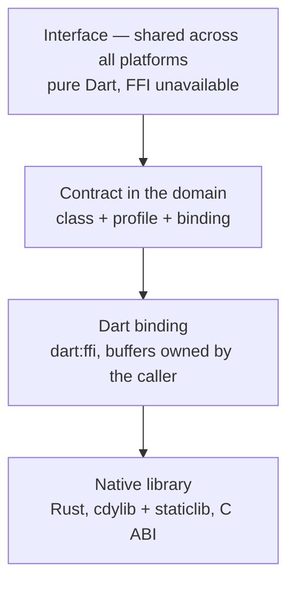

# Device protocols — how this package is built

A package of **shared code**, not of capability: everything in it is expressible
in Dart. The reason it exists is a different one — **one implementation instead
of one per transport**. The conversation with a scale was written once in the
product; the conversation with a customer display was written four times, and
four times differently. The divergences turned out to be defects, not
variations.

## Where the boundary runs



**`dart:ffi` does not exist in the browser.** So this package lives strictly
below the contract, and `lib/presentation/` does not import it — the web build
keeps working after any change to the native layer.

## The rule this package is shaped by

**Timing that a peripheral controller owns stays there.** MDB's
five-millisecond reply window and a stepper drive's 1.9 µs pulse are held by a
hardware timer and a UART, not by a general-purpose host that is running a till.

The measurements are in `docs/superpowers/specs/2026-07-31-rk_rt-design.md`:

- MDB: 9600 baud, nine bits per byte — about 0.94 ms per byte, 104 µs per bit.
  The ninth bit is a **data bit, not a parity bit**; an ordinary PC UART does
  not set it at all, so the problem is in the electrics, not in the scheduler.
- The host is running Flutter, a database, printing and video. There is no RT
  kernel on `telepos-os` today; the x86 route is a paid subscription and the
  RPi5 route is a self-maintained kernel. Even on a tuned `PREEMPT_RT` there are
  still spikes of 50–300 µs (SMI on x86) and up to 800 µs under load on an
  RPi5.
- A missed reply would land exactly at the moment the till is busy — that is,
  when it is selling.

Hence: this package **frames and parses, but never waits**. The native library
performs no I/O, opens nothing, never sleeps and spawns no thread. Every call is
a pure function of its arguments.

**"No device failure blocks taking money" is structural here, not promised.**
Something that cannot wait cannot hold anyone up.

The one place where time appears at all is the settling rule for scales. It has
no clock either: the caller supplies the elapsed time on every step, and the
budget is given as a **duration, not a number of attempts** — otherwise a port
that answers every 5 ms and a port that answers every 5 s would get completely
different real deadlines out of the same number.

## How the package maps onto the product's device model

The product describes a device as a **class** + a **profile** + a **binding** —
the profile declares the connection parameters it requires, and a binding
missing one of them is rejected. This package reinvents none of that and stores
none of it:

| Product model | What the package does |
| --- | --- |
| `DeviceClass` | does not know about it; it knows about scales, displays, drawers and MDB separately |
| `DeviceProfile` | accepts the **names** of models and protocols — `cas`, `vfd20`, `escpos_kick`. The profile stays data in the product's catalogue; the package only understands the name the catalogue used |
| `DeviceBinding` | does not see it at all: addresses, ports and keys are transport, and there is no transport here |
| `DeviceCapabilities.displayColumns` | is checked against `rk_devices_display_geometry`: `led8` has eight columns and one line, `vfd20` has twenty and two |

Profiles stay data. The package is the protocol code that a profile refers to by
name; a new model that speaks an already known protocol is still just a row in
the catalogue.

## What crosses the boundary

**Names only, never numbers.** A number changes meaning the moment a case is
inserted into the middle of a list. Protocols, models, operations, pins,
addresses, wires, verdicts and statuses are NUL-terminated UTF-8 strings in
both directions.

A call returns 0/1/2, and that is not an enumeration but a property of the
calling convention: it worked, it did not work, there was not even room for the
name of the reason. There is no fourth outcome of a call, so there is no list
into whose middle a case could be inserted.

## Who frees what

**The caller, everything.** The library allocates nothing that crosses the
boundary: every result is written into a buffer the caller allocated. There is
no free function, because there is nothing to free.

If the buffer is too short, the call **first** writes the required length into
`out_len` and only then reports `buffer_too_small`, so that the caller can
allocate exactly what is needed instead of guessing.

The one exception in form, though not in substance, is the scale settling rule:
it has state. Its size and alignment are published
(`rk_devices_stabilizer_size`, `..._align`), the caller allocates it, and
`Stabilizer.dispose()` is a `calloc.free` at a moment the caller chose. Dart's
garbage collector is never asked about native memory.

## A failure is a value

Never an exception across the boundary, never a crashed process. Every
exported function is wrapped in `catch_unwind`; a panic becomes the name
`"panic"`, nothing unwinds into a foreign stack and nothing aborts the
process. The crate **refuses to compile** under `panic = "abort"`, where
`catch_unwind` would be decoration:

```rust
#[cfg(panic = "abort")]
compile_error!("rk_devices must be built with panic=unwind: ... \
                catch_unwind cannot catch an abort.");
```

`rk_devices_provoke_panic_for_test` exists so that a consumer can **prove** this
rather than take it on trust.

## Partial writes: three wires, three answers

The place where correctness lives, and the place where the product has already
been burned.

| Wire | What a write returns | What a remainder means |
| --- | --- | --- |
| `serial` | the number of bytes accepted | a **continuation**: send the tail, never the whole thing again |
| `socket` | nothing (`add`/`flush` return `void`) | unknowable: a failed `flush` does not say how much reached the wire |
| `usb_raw` | nothing (`writeFromSync` either returned or threw) | unknowable, and worse: the driver may have taken part of it |

A partial count claimed for a socket or a raw USB node is **refused**, not
believed: FFI creates no information the transport does not have, and continuing
from an invented offset sends the wrong bytes.

The reasoning and the measurements are in
`docs/superpowers/specs/2026-07-31-rk_escpos-design.md`, question 3.

## What measurement found, and what is fixed here

Four defects, each of them a divergence between two implementations of the same
thing:

1. **CP866 is not contiguous, and `vfd_display.dart` assumed otherwise.**
   `а..п` is `0xA0..0xAF`, while `р..я` jumps to `0xE0..0xEF`. A mapping of
   `0x410..0x44F -> 0x80 + offset` yields different letters for half the
   lower-case alphabet. Right next to it, in `led_display_extended.dart`, sat a
   `Cp866Encoder` that does it correctly.
2. **`led_display.dart` wrote `text.codeUnits` into a `Uint8List`**, which
   truncates anything above 255 to its low byte: Cyrillic was never encoded for
   an LED display at all.
3. **A sign separated from the digits by padding.** CAS sends `-  0.500kg`; the
   expression `([+-]?\d+[.,]\d+)` does not survive the spaces, so minus half a
   kilo read as plus half a kilo — a return booked as a sale.
4. **Overload was indistinguishable from instability.** Everything except `ST`
   collapsed into "still wobbling", and a scale reading 200 kg on a 30 kg
   platform would have waited forever.

A fifth item is not a defect but honesty: Kazakh and Kyrgyz letters and the `₸`
sign have no slot in CP866 at all. The substitution with a space stayed, but it
is now **counted**, so the caller knows the customer was shown something other
than what was asked for.

## Boundaries: what is not in this package

- **MDB bus timing.** It belongs to the bridging microcontroller. The 5 ms
  window is published as a number with which that bridge is configured.
- **I/O.** No port, no socket, no device node.
- **Unit conversion.** A conversion is a rounding decision about a quantity that
  is about to be multiplied by a price.
- **Per-platform build scaffolding.** Plain `cdylib`/`staticlib` with a C ABI:
  the build mechanism is chosen once for all packages, separately.
- **Proof on hardware.** Not one byte sequence here has ever met a device. The
  MDB address and command table is transcribed from secondary engineering
  sources — the NAMA standard is not freely distributed — and that is exactly
  why `mdbEncodeRaw` exists.
