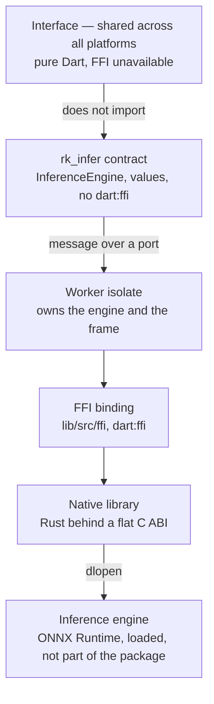

# On-device inference — how this package is built

## Where the boundary runs

The rule everything follows from: **`dart:ffi` does not exist in the browser**.
Native code lives strictly below the contract, the interface knows nothing about
it, and the web build keeps working after any change to the native layer.

The second rule, specific to this package: **what runs between the contract and
the native part is not only a call but an isolate boundary.** It is not there
for convenience — it keeps every native call off the interface isolate and it
keeps the raw frame inside the worker that owns it, and both guarantees rest on
its existence.

## Why we embed an engine rather than write one

Inference engines are written in C++, and this is the case where native code is
justified by **capability** rather than by speed — two grounds that are not
interchangeable, since a rewrite for speed would owe a measurement first. Dart
has nothing of the kind at all.

The baseline is **ONNX Runtime**: MIT-licensed, and its own guidance for the C
API states that no C++ exception crosses the boundary — everything turns into an
`OrtStatus*` that the caller is obliged to free. That is already a failure
returned as a value rather than thrown across the boundary, and it is why ONNX
Runtime is the baseline, not because we like it.

Writing our own engine is not considered at all: kernels for a specific
SIMD/GPU/NPU are optimised by teams with hundreds of engineer-years. Embedding a
finished one takes weeks; writing one is a separate product.

## What has to be true, and what holds it

| Rule | What secures it, rather than promising it |
| --- | --- |
| A failure is a returned value, never an exception across the boundary | `boundary()` in `src/lib.rs` catches both a failure and a panic; `panic = "unwind"` in release, because aborting the process is the same disaster by another route |
| Nothing runs on the interface isolate | the contract has no synchronous methods; every one of them is a message to the worker isolate |
| Freeing is deterministic, not left to a garbage collector | the frame buffer is allocated and freed by Rust; a run **borrows** it; the free happens in a `finally` |
| Enumerations cross by name, never by number | status, format, task and execution provider are NUL-terminated strings in both directions; no number crosses the boundary |
| The raw frame does not leave the worker that owns it | there is no pixel-reader function, neither in the C ABI nor in the contract |

## Who frees what

One sentence per allocation, because the frame buffer is megabytes and on this
hardware that is the difference between "works" and "swaps".

| What | Who allocates | Who frees | When |
| --- | --- | --- | --- |
| Pixel buffer | Rust, `rk_infer_frame_new` | Rust, `rk_infer_frame_free` | the `finally` of the same `run` call |
| Failure detail string | Rust | the caller, `rk_infer_string_free` | immediately after reading it |
| Model session | Rust, `rk_infer_model_load` | Rust, `rk_infer_model_unload` | on an explicit `unload`, or when the engine closes |
| Engine | Rust, `rk_infer_engine_open` | Rust, `rk_infer_engine_close` | on `close`; refuses with `EngineBusy` while models are alive |
| Result | Rust, `rk_infer_run` | Rust, `rk_infer_outcome_free` | in the same `finally` |

Dart **neither allocates nor frees the frame pixels**. It gets a pointer to
write into, copies into it, and forgets the representation. There is one
direction only.

A run **borrows** the frame rather than taking it: ownership does not move.
Freeing during a borrow answers `FrameInUse` and frees nothing — otherwise it
would be exactly the use-after-free the check exists to prevent.

## Why the frame comes in by transfer

`run` takes a `TransferableTypedData`. That is a **move**: the buffers it is
built from are detached from the sender at the moment of construction. By the
time the frame reaches the worker isolate, the caller does not have the pixels
either.

It can be materialised **once**, and that happens inside the isolate that owns
the engine. After that: one copy into the native buffer, then the free.

There is no way back: no method on the contract returns bytes. This is checked
by `test/no_raw_frame_test.dart`, which walks the surface through `dart:mirrors`
and derives the roots of the walk **from the `export` directives**, not from a
hand-maintained list. A hand-maintained list drifts, and drift in this test is a
silent permission.

## Scope: two tasks, of different maturity

The product names six events for which video is correlated with the till. Four
are till events with video pinned to them by time; they need no model. The
fifth, the self-checkout weight check, is a number from a scale. That leaves
two:

- **`visitorCount`** — an engineering task, and a **fallback**: a camera or an
  NVR speaking ONVIF Profile M already counts, and where it does, nothing here
  runs. Accuracy is low by nature — someone walking a circuit counts twice, a
  group counts as one — and what the product wants is an hourly trend, not a
  legally meaningful number.
- **`unscannedItemHint`** — **open research**, not a capability whose accuracy
  can be vouched for. It is a filter that narrows what a person reviews, not a
  detector of theft, and it must not be called the latter. Commercial solutions
  of this class are built on dedicated camera arrays and server infrastructure,
  and not one of them publishes verifiable accuracy figures — meaning there is
  no reference point to compare against either.

Barcodes from a camera are solved separately by a scanner and are not touched
here.

## Accelerators

**CPU is the guaranteed path on every host, and the only one this build
declares.** An accelerator is declared when it is found, and never when it is
hoped for.

The floor of the product's hardware is a thin client whose VIA Chrome9 has no
KMS and no `/dev/dri` at all. There is nothing there to accelerate with, and the
honest answer is `Cpu`. Any frames-per-second figure must be measured on such a
machine, not on a development one.

## What this package does not do

- **It opens no network connections.** The RTSP stream is read by the video
  provider, which hands a decoded frame in memory to this package.
- **It writes nothing to disk beyond reading the model.** The frame reaches
  neither a temporary file nor a cache.
- **It downloads neither models nor the engine.** Both arrive as a signed apt
  package — see `doc/models.md`.
- **It stores no video.** The NVR stores it; the stream never passes through
  the system, and only a reference to the moment is kept.
- **It does not decide how the native part is built for each platform.** The
  crate produces a `cdylib` and a `staticlib` with a flat C ABI; the choice of
  build mechanism is one decision for all `rk_*` packages and is not
  pre-empted here.
