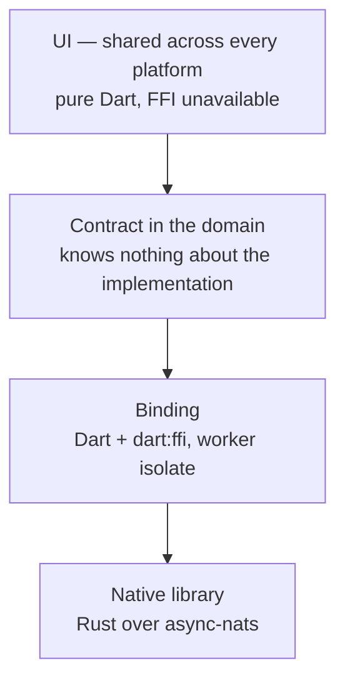

# NATS and JetStream for Dart — how it is built

The durability contract has a document of its own: `doc/durability.md`. Here:
the boundary, its rules, and where this package stands next to `rk_zenoh`.

## Where the boundary runs



The rule everything else follows from: **`dart:ffi` does not exist in the
browser**. So native code lives strictly below the contract, the UI knows
nothing about it, and it keeps building for web.

## The shape of the boundary

One JSON string in, one JSON string out. Every function has the same signature:

```c
char *rk_nats_publish(const char *request_json);
void  rk_nats_string_free(char *reply);
```

Three consequences, all three chosen deliberately.

**Enums cross the boundary by name.** In JSON there is no other way to
write them. A number changes meaning on the day a case is added in the middle of
a list, and reports that fact by nothing at all.

**Adding a field is not an ABI change.** A binding built on Monday calls a
library built on Friday. The ABI version (`rk_nats_abi_version`) changes only
when a function itself appears, disappears or changes meaning, and the binding
**refuses to run** against a version it does not know rather than trying.

**There is exactly one freeing rule.** Everything that returns a `char *` is
freed through `rk_nats_string_free` exactly once; `rk_nats_abi_version` returns
a static and is never freed. No other pointers cross the boundary, so there is
nowhere else to get it wrong.

## Connections are integers, not pointers

An open connection lives in a table and is named by a number.

A stale number returns `handleClosed` **as a value**. A stale pointer returns a
crash in somebody else's stack, and a failure never crosses this boundary as a
crashed process.

The second consequence turned out to be no less useful: a number travels between
Dart isolates without trouble. So the worker isolate opens the library itself and
holds only an integer, and nothing unsafe flies across the isolate boundary.

## Not one call on the UI isolate

The calls block: publishing waits for an acknowledgement, and an acknowledgement
nobody waits for is not worth having. On the isolate that draws the screen, that
is a freeze for as long as the disk takes.

So `RkNatsWorker` is a long-lived isolate rather than an isolate per call:
spawning an isolate and opening the library for every publish would cost more
than the publish itself, and the safe setting is already paying for a disk sync.

This is checked live, not taken on trust: in `test/live_test.dart`, timer ticks
on the calling isolate are counted during twenty consecutive publishes. Zero
ticks would mean the call had been made here.

## Failure is a value

No boundary function lets an exception out and none crashes the process:

- each body is wrapped in `catch_unwind`, a caught panic becomes
  `{"code":"panic"}`, and the library stays usable;
- a null or non-UTF-8 argument becomes `invalidRequest`, not a dereference;
- no call waits forever — each has a deadline, and its expiry is `timeout`.

This is verified by the library containing a function that panics on purpose
(`rk_nats_panic_for_test`). A `catch_unwind` that has never fired is a
`catch_unwind` nobody knows the state of.

## The mirror of the rules in Dart

The durability rules live on the native side. Dart holds a copy, because the
caller needs to understand an acknowledgement without a trip across the
boundary, and a settings screen needs to check a policy before a connection
exists.

Two copies of one rule drift apart. So the library hands over **the whole
decision table** (`rk_nats_gate_matrix`), and `test/native_boundary_test.dart`
checks it against the Dart copy for each of the fifteen pairs. This is not two
implementations of one capability — it is one contract, checked from both ends.

## Next to `rk_zenoh`

`rk_nats` is **not** offered as a tunnel transport; that role belongs to QUIC.
The "relay introduces, then the parties talk directly" model is about connecting
two sides, whereas NATS is a broker by nature and all the traffic would go
through it.

This package exists for different work: a durable queue. A sale leaving a till
for the shop server has to survive a reboot and must not arrive twice. The NATS
leaf-node topology fits a shop that loses its link: the leaf node keeps
accepting writes locally and forwards them when the link is back — an outbound
queue.

## What is not decided here

How the native library gets onto the machine. The per-platform build mechanism
is chosen once for all `rk_*` packages — a Flutter FFI plugin — and is
written up in [`native-build.md`](native-build.md). What this document is
responsible for stops at a `cdylib` and a `staticlib` with a C ABI, so that
wiring it up stays mechanical.
