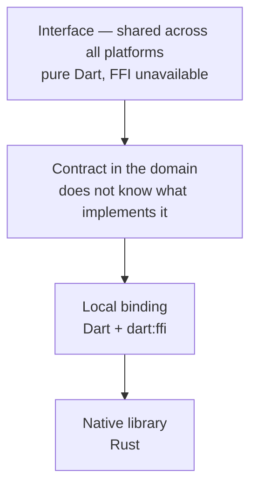

# QUIC and WebTransport — how this package is built

## Where the boundary runs

The rule everything follows from: **`dart:ffi` does not exist in the browser**.
So native code lives strictly below the contract, and the interface knows
nothing about it and keeps building for web.

## Why a native library rather than Dart

Dart has no QUIC implementation of its own, and both requests in the SDK tracker
are closed as "not planned" (2015 and 2019). So the choice is not between "in
Dart" and "natively" but between "natively" and "not at all". WebTransport
requires HTTP/3 on top of that, which means the server has to speak QUIC — and
our server side is in Dart.

## What has to be true in the implementation

- A failure in the library cannot bring the process down: an error is returned
  as a value, not as an exception out of a foreign stack.
- No call blocks the user interface thread.
- Everything allocated in the native part is freed deterministically — Dart's
  garbage collector knows nothing about it.
- Enumerations cross the boundary **by name**, never by number: a number changes
  meaning the moment a case is inserted into the middle of a list.

All four hold in 0.2.1. The endpoint, the sessions and the events are
implemented on quinn; the reasoning for quinn over quiche, the outcome table for
loading the library, and what has actually been proved on which platform are in
the README, and the build mechanism is in `doc/native-build.md`.
