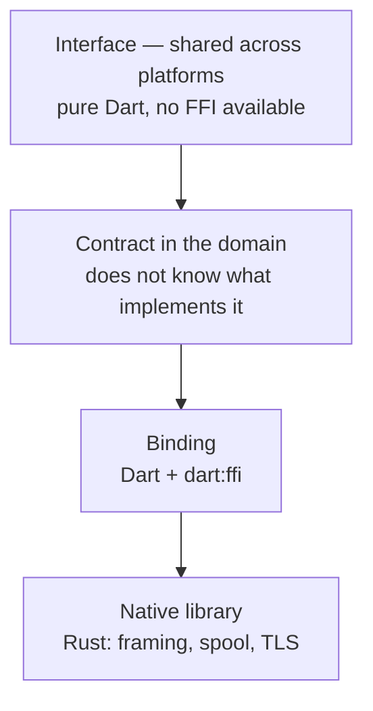
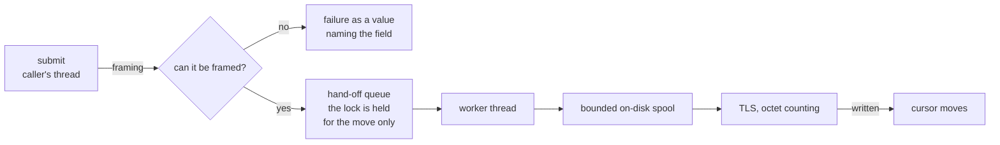

# How rk_syslog is put together

**State: working.** It frames, it spools, it delivers. Since 0.2.0 the
per-platform build mechanism is here as well — one mechanism for the whole
family of `rk_*` packages; see [`native-build.md`](native-build.md).

## Where the boundary runs

`dart:ffi` does not exist in a browser, so native code lives strictly below the
contract and the interface keeps building for web.

## Why a native library rather than Dart

The reason is **possibility**, not speed — and not in the sense that is usually
meant. RFC 5424 framing can be written in Dart, and so can TLS. What Dart
cannot give you is **a sink that survives a crash of the process and does not
block its caller**, because both require a thread living outside the isolate's
event loop and owning its own file descriptor and socket. A Dart isolate would
get half of it: it would not stop the caller, but it stops itself when the
process stops — and surviving exactly that is what the spool is for.

The second reason is **shared code**. The sink is not only needed by the
Flutter application: the machine-management daemon and the shop server need the
same library, and one implementation with one set of checks beats three that
drift apart.

## The path of one record

Framing happens on the caller's thread so that the failure lands where the
mistake was made. Everything that can wait is on the worker thread so that the
caller never waits.

## Three decisions that have to be answered for

### Submitting does not wait, so durability starts later

A record becomes durable when the worker thread has written it to the spool,
not when it was submitted. A crash loses whatever was still in the hand-off
queue; that window is bounded by `queue_max_records`. Anyone who needs a point
of durability here and now calls `flush`, and only they block.

The alternative — a synchronous disk write on every submit — would turn every
log record into a disk round trip on a machine that is taking money. That is a
price that cannot be paid; the price chosen instead is a bounded loss window,
stated honestly.

### The spool bound loses data, and that is not hidden

The `drop_oldest` rule deletes **a whole segment**, not a single record.
Otherwise deletion would mean rewriting a file, and rewriting a file at the
bound is work that grows with the size of the spool at exactly the moment the
system is already under load. The cost of that granularity is written down in
the README: up to `spool_segment_bytes` at a time.

The loss does not stay quiet twice over: there is a `spool_dropped_records`
counter, and **a record in the log itself** in place of the deleted ones. The
counter is read by whoever thought to ask; the record is seen by whoever simply
reads the log.

### Delivery is at least once

The cursor moves after the write to the socket. A crash between the write and
saving the cursor produces a duplicate. The opposite order would produce a
loss. For a log a duplicate is an inconvenience and a hole is a defect, so the
duplicate was chosen — and that is written down rather than implied.

There is nothing to make it "exactly once" with: RFC 5425 has no
application-level acknowledgement, and "delivered" is not something the two
sides can agree on.

## What has to be true, and how that is checked

| Requirement | Checked by |
| --- | --- |
| A failure comes back as a value; a panic does not escape | `rk_syslog_provoke_panic` is called from a Rust test and from a Dart test; `panic = "unwind"` is pinned in the profile |
| Nothing is allocated without a deterministic release | the "who frees what" table in the `ffi` module documentation; `close` joins the worker thread |
| Enumerations by name | the numbers are pinned by tests on both sides; `verifyNameTables` compares the tables at run time |
| A record that cannot be framed is reported | tests for every header field, SD name, parameter value, and for exceeding the size |
| The spool is bounded | a test writes 4 MiB into a 128 KiB spool and measures the bytes **on disk**, not the counter |
| Submitting does not block | a collector at 192.0.2.1 (TEST-NET-1, never answers) with a 20 s connect timeout; 20 000 submits must fit inside 3 s |
| RFC 5425 delivery works | a rustls collector with a certificate issued on the spot; fingerprint pinning, the root bundle, and the fact that a mismatched fingerprint lets **no** records through are all verified |

Two mutations were checked for redness: removing the bound check in
`Spool::append` (the spool grows to 4.5 MiB against a 128 KiB bound, three
tests fail) and waiting for the worker thread inside `Queue::push` (the
non-blocking-submit test stops fitting, taking 440 s instead of 20 s).

## What is not here

- **Masking.** The package does not know that a field is a secret.
- **A chain of audit fingerprints.** Immutability of the audit log is a
  property of the log's owner, not of its transport.
- **The receiving side.** The package sends; the collector is somebody else's.
- **Rotation of local text files.** The spool is a delivery queue, not an
  archive.
