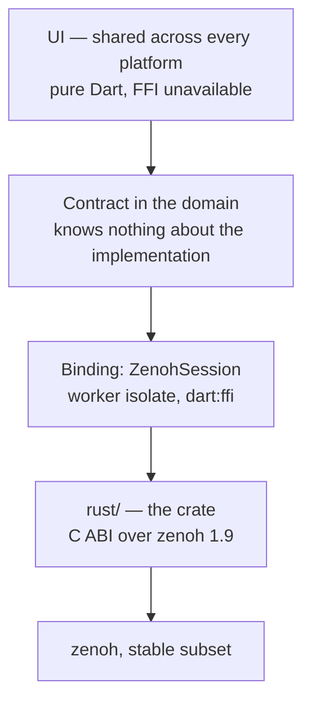

# Zenoh for Dart — how it is built

## Where the boundary runs

The rule everything else follows from: **`dart:ffi` does not exist in the
browser**. So native code lives strictly below the contract, the UI knows
nothing about it, and it keeps building for web.

## Four conventions, all four load-bearing

### Failure is a returned value

Every `extern "C"` function returns an `int32`: zero is success, non-zero is
failure. **The non-zero value carries no meaning.** What actually happened, the
caller learns from `rkz_last_error_kind()` — a stable **name**, not an index.

The body of every function is wrapped in `catch_unwind`. A panic below the
boundary becomes the name `panic` plus a message; nothing unwinds out of a
foreign stack.

### Ownership is one-way

Everything the library hands out as `*mut Rkz…` belongs to the caller until the
matching `rkz_…_drop`. The library **never** frees a handle itself.

| What | Who frees it | With what |
| --- | --- | --- |
| configuration | the caller | `rkz_config_drop` |
| session | the caller | `rkz_session_drop` |
| subscription | the caller | `rkz_subscriber_drop` |
| publisher | the caller | `rkz_publisher_drop` |
| liveliness token | the caller | `rkz_liveliness_token_drop` |
| sample | the caller | `rkz_sample_drop` |
| the string from `rkz_last_error_*` | **nobody** — it is static, or lives until the next call on this thread | — |
| a sample's key and bytes | freed together with the sample | — |

On the Dart side, `NativeSession` is what makes freeing happen exactly once: it
holds every handle, hands out only integer identifiers, and frees everything in
`close()`. There are deliberately no finalisers — Dart's garbage collector knows
nothing about native memory, and relying on it means not freeing at all.

The type tag in each handle catches a kind mix-up (a subscription passed where a
session was expected) before the dereference. It does **not** catch freeing the
same handle twice: after `free`, reading the tag is already too late.

### Enums cross the boundary by name

Session mode, congestion control, priority, sample kind — all strings. An index
is a promise that nobody will insert anything into the middle of a list, and
upstream makes no such promise.

### Nothing on the UI isolate

`ZenohSession` spawns a worker isolate and holds it until `close()`. Every
native call happens there. Samples are received by **pulling, not by callback**:
the isolate polls subscriptions with a zero timeout and sleeps for 5 ms when
there is nothing. A callback from Zenoh would have to be delivered into the
isolate, and then the UI isolate would be one mistake away from becoming the
executor.

A side effect: the native library is always used from a single thread.

## Building

`rust/` is a plain `cdylib`/`staticlib` with a C ABI, built by `cargo build
--release`. The output stays in `rust/target/`, which is listed in both
`.gitignore` and `.pubignore`: build output travels neither into the repository
nor into the package.

The per-platform scaffolding is a **Flutter FFI plugin** — one mechanism for the
whole family. A `hook/` directory is forbidden, because its mere presence
breaks `dart run`, `dart test` and `flutter build`. Which file does what, and
why Android does not go through CMake, is in
[`native-build.md`](native-build.md). Outside a built application the library is
located by an explicit path, by `RK_ZENOH_LIBRARY`, or next to the executable.

`panic = "unwind"` is pinned in the release profile on purpose: the boundary
catches panics so that failure leaves as a value, and `panic = "abort"` would
make that claim false.

## What to read next

- [`stale-zid.md`](stale-zid.md) — the measured failure and both ways out of it.
- [`stable-subset.md`](stable-subset.md) — what is in, what is not, and why not
  `zenoh-c`.
